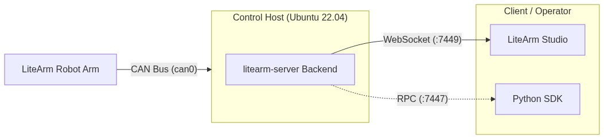

# LiteArm Quickstart Guide

## 1. System Architecture & Communication

The robotic arm connects via a USB-CAN adapter to the host running the control service (either the user's PC or a dedicated IPC / edge compute box). The system natively supports both single-machine operation and distributed LAN control:



### Deployment Modes
- Single-Machine Mode: Both the backend service and LiteArm Studio run on the same computer; connect via `127.0.0.1:7449`.
- Dedicated Host Mode: The backend service runs on an independent IPC or compute box connected to the arm; connect via the host's LAN IP address from another PC.

### Default Communication Parameters
- Studio Endpoint: Port `7449` (WebSocket, `127.0.0.1` for local, LAN IP for distributed host)
- Python SDK Port: `7447` (RPC / Zenoh)
- CAN Interface: Default `can0` (1 Mbps, initialized automatically upon service startup)

### System Requirements
- Control Host (Backend): Ubuntu 22.04 LTS, USB-to-CAN adapter supporting SocketCAN
- Operator PC (Studio): Ubuntu 20.04+ or Windows 10/11

---

## 2. Backend Deployment (litearm-server)

### 2.1 Package Installation

On the Ubuntu host (PC or IPC box) connected to the robotic arm:

```bash
sudo dpkg -i litearm-server_<version>_amd64.deb
```

> The package automatically registers the `litearm-server-bin.service` system service. The service automatically initializes and brings up `can0` at 1 Mbps.

### 2.2 Configure Operating Mode

Configuration file: `/etc/litearm-server.env`

- Hardware Mode: Connect the USB-CAN adapter and robotic arm; keep default configuration.
- Simulation Mode (Dry-Run): If no CAN hardware or arm is connected, enable simulation to avoid initialization errors:
  ```env
  LITEARM_EXTRA_ARGS="--dry-run"
  ```

### 2.3 Start the Service

```bash
# Start background service
sudo systemctl start litearm-server-bin

# Check status and logs
sudo systemctl status litearm-server-bin
sudo journalctl -u litearm-server-bin -f -n 50
```

> Startup is successful once the log indicates WebSocket is listening on port `7449`.

### 2.4 Terminal Debugging & Headless Control (Optional)

To debug in the foreground or verify motion without a GUI:

```bash
# Run in foreground with debug logs
litearm-server --dry-run --log-level DEBUG

# CLI Verification (Read joint angles)
python3 -c "import litearm; arm=litearm.Arm('tcp/127.0.0.1:7447'); \
    print('Joints:', arm.get_state().q); arm.close()"

# CLI Home
python3 -c "import litearm; arm=litearm.Arm('tcp/127.0.0.1:7447'); \
    arm.home(); arm.close()"
```

---

## 3. Host Installation (LiteArm Studio)

### Windows
Run `LiteArm Studio-Setup-<version>.exe` to install and launch.
If prompted for WebView2, install the [Microsoft Edge WebView2 Runtime](https://developer.microsoft.com/microsoft-edge/webview2/).

### Linux / Ubuntu
```bash
# DEB package (recommended)
sudo dpkg -i "LiteArm Studio_<version>_amd64.deb"
litearm-studio

# Or run AppImage directly
chmod +x "LiteArm Studio_<version>_amd64.AppImage"
./"LiteArm Studio_<version>_amd64.AppImage"
```

---

## 4. Initial Smoke Test

### Step 1: Connect to Backend Service
1. Launch LiteArm Studio.
2. Click the connection status badge in the top header to open "Controller Connection Settings".
3. Enter the endpoint IP according to your setup (port remains `7449`), then click Connect:
   - Single-Machine Mode: Keep default `127.0.0.1`;
   - Dedicated Host / IPC Box: Enter the host's actual LAN IP address.


> Success Indicator: Badge turns green showing `Connected`, and control frequency begins updating (~250 Hz).

### Step 2: Verify 3D Model
Open the Solo Control page. Confirm the 3D robot arm model is rendered properly and joint readings J1–J7 show valid values.

### Step 3: Motion Verification

> [!WARNING]
> On physical hardware, ensure the arm's workspace is clear of obstacles and personnel; use the Studio "STOP" button to halt motion if necessary.

1. Enable: Click the Enable toggle on the control panel.
2. Jog Test: Select J1 under joint controls, set speed to 10%–20%, click `+` to nudge by 1°–2°, and verify smooth response.
3. Home Test: Click Home Position to return the arm to its zero position.

---

## 5. Troubleshooting (FAQ)

### Q1: Studio shows connection failed or timeout?
1. Ensure the connection endpoint is set to `127.0.0.1:7449`.
2. Check if the local backend service is running:
   ```bash
   sudo systemctl status litearm-server-bin
   ```
3. If inactive, start it with `sudo systemctl start litearm-server-bin`. If in `failed` state, check Q2.
4. (If connecting over LAN): Ensure both PCs can `ping` each other and firewall port `7449` is open: `sudo ufw allow 7449/tcp`.

### Q2: Backend service failed to start or constantly restarting?
- Inspect detailed logs: `sudo journalctl -u litearm-server-bin -e`
- Cause 1: USB-CAN adapter missing or unrecognized
  - The service automatically configures `can0` on startup. If the adapter is unplugged or named differently, the service exits.
  - Verify that the CAN interface is detected:
    ```bash
    ip link show can0
    dmesg | grep -i can
    ```
  - If recognized under a different name (e.g. `can1`), configure `LITEARM_IFACE="can1"` in `/etc/litearm-server.env`.
- Cause 2: Testing without hardware
  - If running without arm or CAN hardware, add `LITEARM_EXTRA_ARGS="--dry-run"` in `/etc/litearm-server.env` (see Section 2.2) and restart.
- Cause 3: Arm unpowered or wiring loose
  - Verify that the power supply is on and ensure the power and CAN bus wiring (CAN-H / CAN-L) are securely connected.

### Q3: 3D viewport blank or WebGL initialization failure?
- Ensure graphics drivers support WebGL 2.0.
- If using a VM or remote desktop, enable 3D hardware acceleration.
