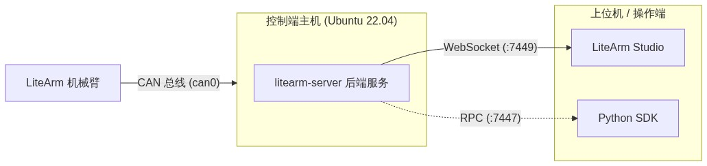

# LiteArm 快速上手指南

## 1. 系统架构与通信

机械臂通过 USB-CAN 适配器连接运行控制服务的主机（用户电脑或独立工控机/计算盒）。系统原生支持单机同屏操作与分布式局域网控制两种模式：



### 部署模式
- 单机直连模式：控制服务与 Studio 上位机均运行在同一台电脑上，Studio 直接连接 `127.0.0.1:7449`；
- 独立主机模式：控制服务运行在连接机械臂的独立工控机或计算盒上，用户在局域网内通过另一台电脑的 Studio 连接其 IP。

### 默认通信参数
- 上位机通信端口：`7449`（WebSocket，单机填写 `127.0.0.1`，跨机填写主机局域网 IP）
- Python SDK 端口：`7447`（RPC / Zenoh）
- CAN 接口：默认 `can0`（波特率 1M，服务启动时自动初始化拉起）

### 环境要求
- 控制端（后端服务）：Ubuntu 22.04 LTS，配备支持 SocketCAN 的 USB-CAN 适配器
- 操作端（Studio 上位机）：Ubuntu 20.04+ 或 Windows 10/11

---

## 2. 后端服务部署 (litearm-server)

### 2.1 安装软件包

在连接机械臂的 Ubuntu 主机（电脑或工控盒）上执行：

```bash
sudo dpkg -i litearm-server_<版本号>_amd64.deb
```

> 安装后自动注册系统服务 `litearm-server-bin.service`。服务启动时会自动初始化并启用 `can0`（1M 波特率）。

### 2.2 配置运行模式

配置文件：`/etc/litearm-server.env`

- 实机模式：连接 USB-CAN 适配器与机械臂，保持默认配置即可。
- 仿真模式（Dry-Run）：若未连接物理机械臂或 CAN 硬件，需开启仿真模式以防驱动报错：
  ```env
  LITEARM_EXTRA_ARGS="--dry-run"
  ```

### 2.3 启动服务

```bash
# 启动后台服务
sudo systemctl start litearm-server-bin

# 查看状态与日志
sudo systemctl status litearm-server-bin
sudo journalctl -u litearm-server-bin -f -n 50
```

> 日志输出 WebSocket 监听于 `7449` 端口即表示启动成功。

### 2.4 终端调试与无头操控（可选）

如需前台调试或在纯终端环境下验证控制：

```bash
# 前台调试启动
litearm-server --dry-run --log-level DEBUG

# CLI 快速验证（读取关节角度）
python3 -c "import litearm; arm=litearm.Arm('tcp/127.0.0.1:7447'); \
    print('关节角:', arm.get_state().q); arm.close()"

# CLI 回零
python3 -c "import litearm; arm=litearm.Arm('tcp/127.0.0.1:7447'); \
    arm.home(); arm.close()"
```

---

## 3. 上位机安装 (LiteArm Studio)

### Windows
运行 `LiteArm Studio-Setup-<版本号>.exe` 完成安装并启动。
若提示缺少 WebView2，请下载安装 [Microsoft Edge WebView2 Runtime](https://developer.microsoft.com/microsoft-edge/webview2/)。

### Linux / Ubuntu
```bash
# DEB 包安装（推荐）
sudo dpkg -i "LiteArm Studio_<版本号>_amd64.deb"
litearm-studio

# 或使用 AppImage
chmod +x "LiteArm Studio_<版本号>_amd64.AppImage"
./"LiteArm Studio_<版本号>_amd64.AppImage"
```

---

## 4. 首次联调测试

### 步骤 1：连接控制服务
1. 启动 LiteArm Studio。
2. 点击顶栏左侧的连接状态徽标，打开「控制器连接设置」。
3. 根据部署形态输入 IP 地址，端口保持 `7449`，点击「连接」：
   - 单机直连：保持默认 `127.0.0.1`；
   - 独立工控盒 / 主机：输入该主机的实际局域网 IP 地址。


> 成功标志：徽标变为绿色圆点并显示 `已连接`，右侧控制频率正常跳动（约 250 Hz）。

### 步骤 2：检查 3D 模型
进入「单臂控制」页面，确认左侧 3D 机械臂模型正常渲染，右侧 J1~J7 关节角度显示有效数值。

### 步骤 3：动作验证

> [!WARNING]
> 实机模式下请确保机械臂运动范围内无障碍物及人员，可随时通过上位机「STOP」按钮停止动作。

1. 使能：点击控制面板上的「使能」开关。
2. 点动测试：在关节控制区选择 J1 轴，将速度设为 10%~20%，点击 `+` 微动 1°~2°，确认 3D 模型与机械臂平稳响应。
3. 回零测试：点击「一键回零位」，确认机械臂平稳返回零位姿态。

---

## 5. 常见问题 (FAQ)

### Q1：上位机提示连接失败或超时？
1. 确认连接地址为 `127.0.0.1`，端口为 `7449`。
2. 检查本地后端服务是否正在运行：
   ```bash
   sudo systemctl status litearm-server-bin
   ```
3. 若服务未运行，执行 `sudo systemctl start litearm-server-bin`；若状态为 `failed`，请按 Q2 排查。
4. （若跨电脑局域网连接）：检查两台设备是否可互相 `ping` 通，并在后端电脑上放行对应端口：`sudo ufw allow 7449/tcp`。

### Q2：后端服务启动失败 (failed) 或频繁重启？
- 查看详细日志：`sudo journalctl -u litearm-server-bin -e`
- 原因 1：未插入 USB-CAN 适配器或设备未识别
  - 服务启动时会自动拉起 `can0`。若未插 USB-CAN 或设备识别为其他名称，服务会直接退出。
  - 检查系统是否识别到 CAN 模块：
    ```bash
    ip link show can0
    dmesg | grep -i can
    ```
  - 若系统分配的接口名为其他名称（例如 `can1`），在 `/etc/litearm-server.env` 中配置 `LITEARM_IFACE="can1"`。
- 原因 2：无硬件纯仿真测试
  - 若手头未连接机械臂或 CAN 模块，需在 `/etc/litearm-server.env` 中配置 `LITEARM_EXTRA_ARGS="--dry-run"`（见 2.2 节）后重启服务。
- 原因 3：机械臂未正常通电或接线松动
  - 检查机械臂供电电源是否正常开启，并确认电源线与 CAN 总线（CAN-H / CAN-L）接线牢固。

### Q3：3D 视口黑屏或 WebGL 初始化失败？
- 确认系统显卡驱动正常。
- 若在虚拟机或远程桌面中使用，需开启「3D 图形加速」。
