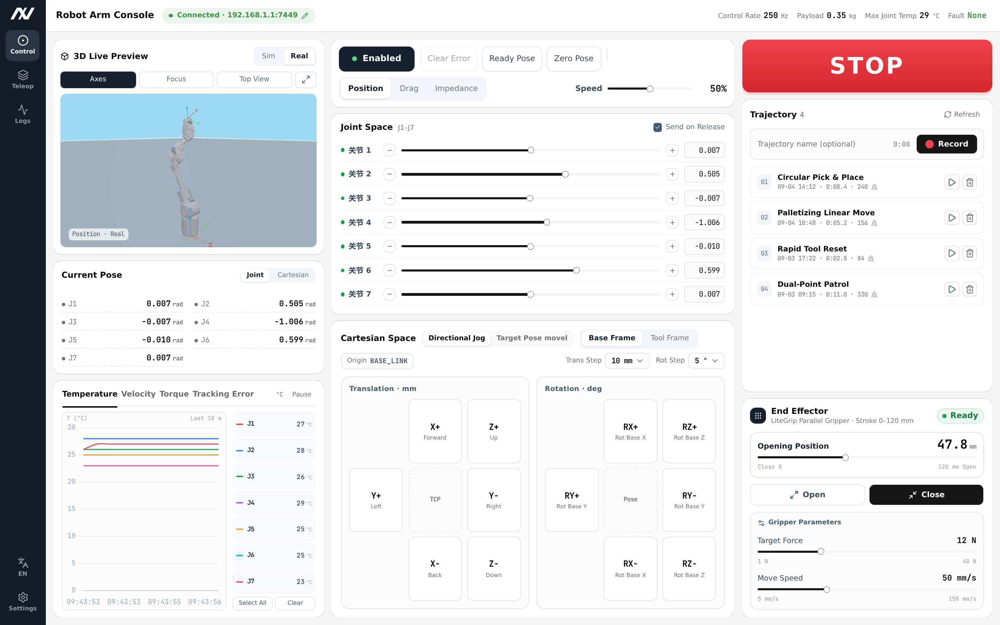
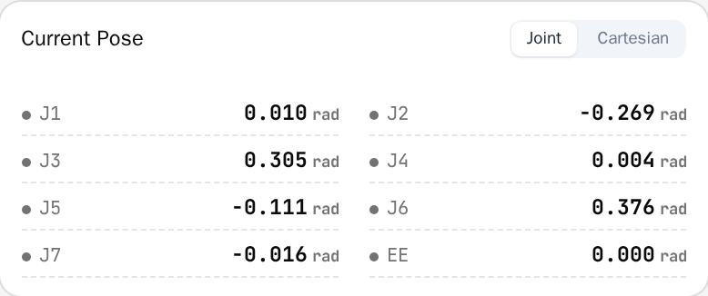
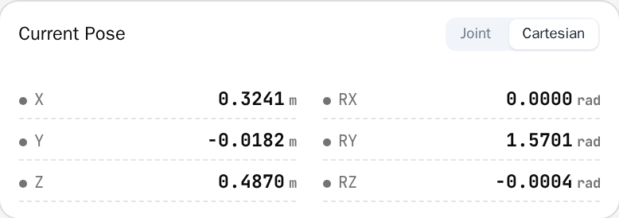
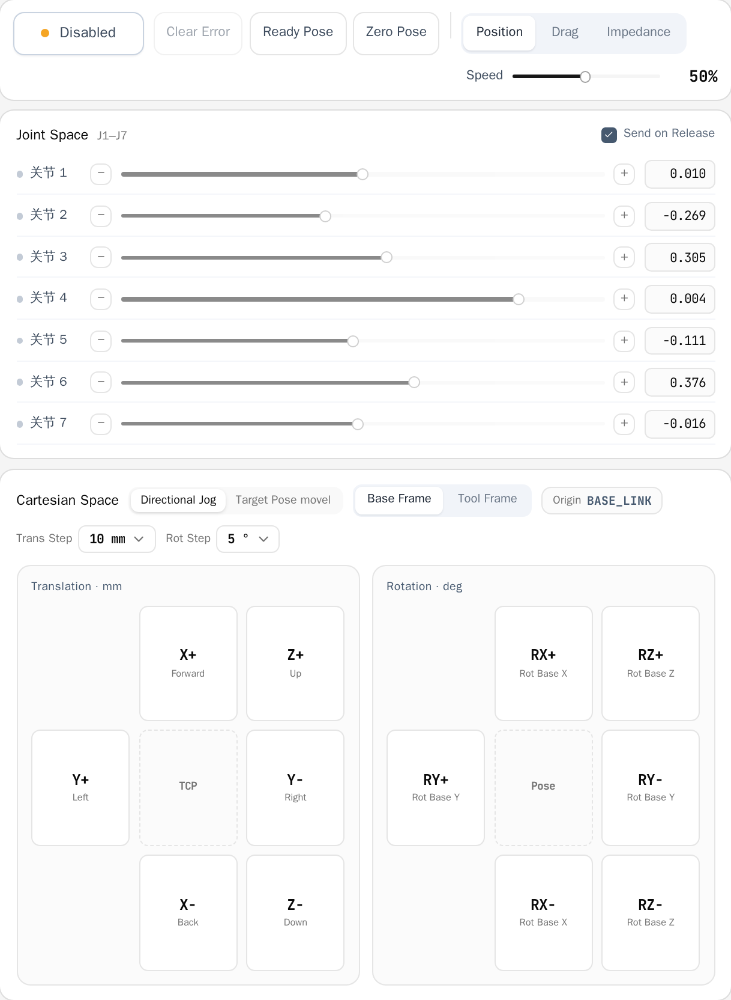
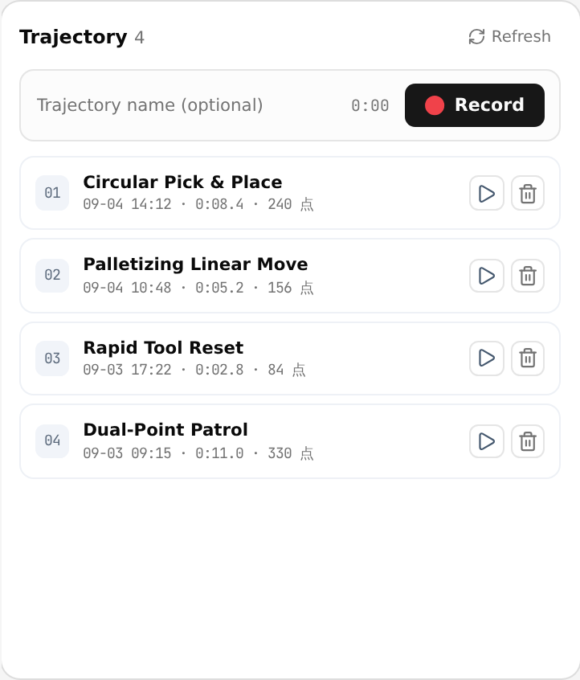
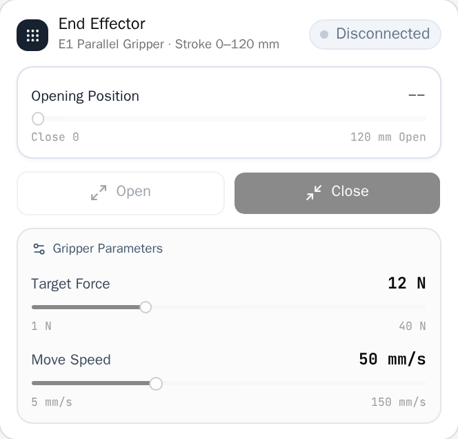
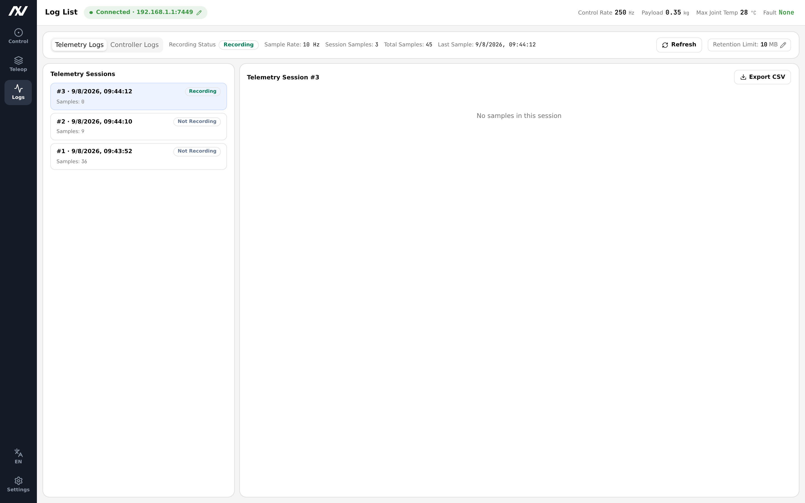
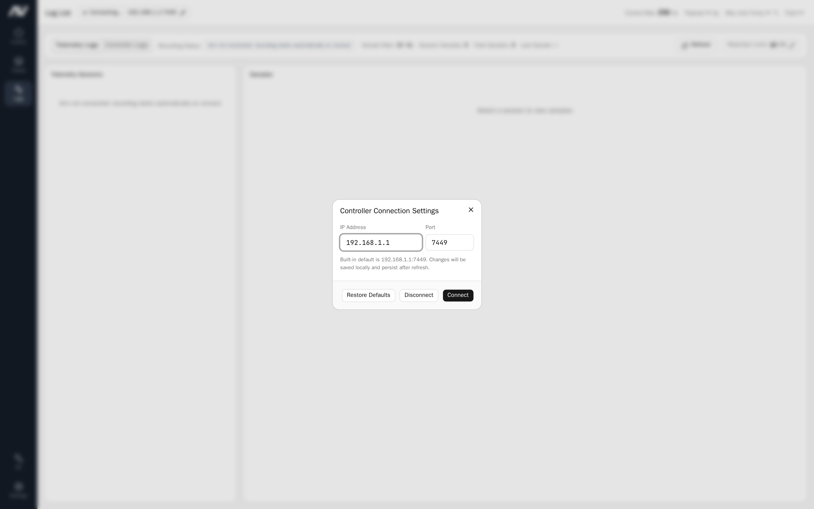
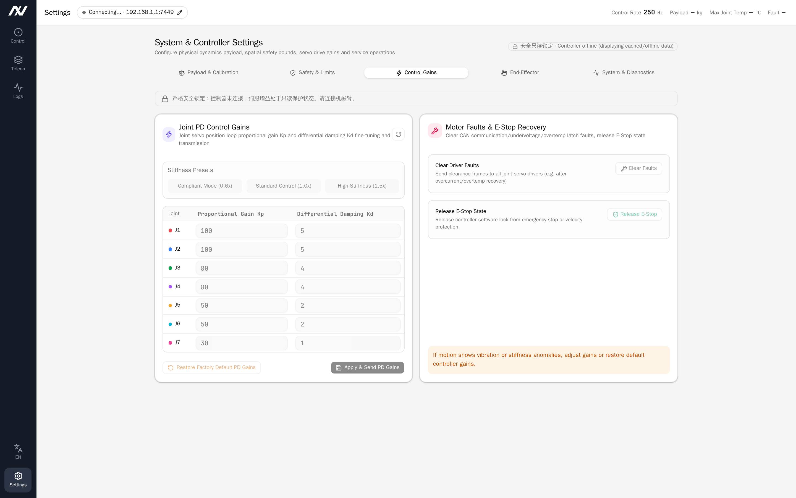

# LiteArm Studio User Manual

## 1. Introduction & Connection

> [!IMPORTANT]
> The robotic arm moves with inertia and force. Before enabling, commanding motions, or applying parameters, ensure the working envelope is clear of personnel and free of obstacles.

### 1.1 Overview

LiteArm Studio is the graphical host software for LiteArm 7-DoF (J1–J7) robotic arms. It provides real-time motion control, trajectory teaching, status monitoring, and system management.

The software is **one local program** (`litearm-studio-daemon`) plus **one browser UI**: the program owns the arm's USB serial port and serves the UI, which talks to it over the loopback interface. **There is no backend server, and no IP address to configure.**

```
Browser window (React UI, served by the local program)
   │ HTTP → static assets, /api/health
   │ WS   → state push / commands
   ▼
litearm-studio-daemon (listens on 127.0.0.1 only)
   ▼
STM32 firmware ──USB CDC (1d50:606f)──> CAN ──> motors
```

| Core Module | Key Features |
| :--- | :--- |
| Control | 3D pose monitoring & simulation, joint angle control, Cartesian jog & linear interpolation, mode switching, one-click homing |
| Trajectory | Zero-gravity manual lead-through teaching, trajectory library, multi-speed & loop playback, safe takeover |
| Telemetry | Joint telemetry sampling & recording, session details, CSV export |
| Settings | End-effector payload, gravity & inertia, gains & limits, diagnostics, gripper & bus, activation |
| Activation | Read the licence state and device UID; submit registration details to obtain this machine's credential and write it to the device |

### 1.2 Install and run

Download the executable for your platform and verify it against the `.sha256` published next to it:

| Platform | File | How to run |
| :--- | :--- | :--- |
| Windows | `litearm-studio-<version>-windows-amd64.exe` | Double-click |
| Linux | `litearm-studio-<version>-linux-amd64` | `chmod +x`, then run |

The Linux file is not executable as downloaded, and it needs glibc 2.35 or newer (Ubuntu 22.04+,
Debian 12+). [INSTALL.md](INSTALL.md) has the download commands, the checksum verification, the
serial-port permission and the first-run activation in full.

The program is self-contained: it needs no Python install and no browser tab opened by hand — it opens a window itself (in `--app=` mode when a Chromium-based browser is present, otherwise a normal tab). It prints the address it listens on, `http://127.0.0.1:8765/` by default; if that port is taken it picks the next free one and prints it — **use the printed address**.

> [!IMPORTANT]
> **On Linux the current user must be allowed to open the serial port** (the device node normally belongs to the `dialout` group), otherwise the UI opens but cannot reach the arm:
> ```bash
> sudo usermod -aG dialout "$USER"   # takes effect after you log in again
> ```
> Alternatively add a udev rule for VID:PID `1d50:606f` with mode `0666`.

### 1.3 Connecting to the arm

On start, the local program **finds the arm's USB CDC device automatically** (VID:PID `1d50:606f`) and opens a session as soon as it appears. The badge on the left of the top bar reports the state:

| Badge | Display | Meaning |
| :--- | :--- | :--- |
| Connected | Green dot · `<port> · <firmware>` | Session established; control and monitoring available |
| Connecting / Reconnecting | Gray / flashing · `Connecting…` | Session being established; the link retries automatically after a drop |
| Connect failed | Red dot · `Connect failed` | Device not found, firmware version mismatch, or link failure |

The **Connect / Disconnect** buttons on the top bar open or close the session by hand. **There is no IP address or port to fill in**; if the device appears at a non-default path, pass `--port`.

### 1.4 Activation (required on first use)

> [!IMPORTANT]
> An unactivated arm **refuses to enable** (the firmware answers `ERR{0x10,0x08}`) while every other command keeps working. Complete this section before first use.

Open **Settings → Activation**. The panel shows this machine's licence state and device UID.

1. While unactivated the panel reads **Not activated** and lists the **device UID** (24 hex characters). Press **Copy** and give that string to your supplier.
2. The supplier issues a credential for this machine's UID.
3. Fill in the registration form — **name, phone, organization, email and region are required**; WeChat ID, industry and purpose are optional — and read and accept the *Activation Registration Consent*.
4. **Disarm the arm first**: the firmware only accepts the licence record while the arm is disarmed, otherwise the submission is rejected with "disarm first".
5. Press **Submit and activate**. The program sends the registration details together with the device UID to the activation service, receives this machine's credential, writes it to the device, and reads it back to confirm.

Once it succeeds the panel reads **Activated** and lists the customer ID, issue date and record version, and the firmware will accept `enable`.

- **The credential is bound to one machine**: a different arm needs a credential issued for its own UID.
- **The record is written once and cannot be erased**: the UI offers no "deactivate"; clearing it means returning the unit to the factory and erasing the licence sector with a debug probe (SWD).
- Activation is the **only action in the whole application that uses the network**. The consent document lists every field that is sent; no internal addresses or host names are collected.
- If the panel reads **Unreadable** or **Unsupported**: press Refresh for the former; the latter means the firmware predates 1.8.0 and must be upgraded.

#### Real-time Health Metrics

The right side of the top bar continuously displays core operational metrics:

- Control Frequency: Underlying real-time loop frequency (nominal ~250 Hz);
- Payload: Currently configured and active end-effector tool/workpiece mass (kg);
- Max Joint Temp: Highest recorded temperature across joint drivers (°C);
- Fault Status: System health indicator (Green "Normal" / Red "Fault").

---

## 2. User Interface Overview



LiteArm Studio consists of the left navigation rail, top status bar, and central workspace. Use the navigation rail to switch between functional modules.

---

## 3. Solo Control

The Solo Control page provides real-time 3D pose monitoring, state readouts, joint and Cartesian motion control, trajectory teaching, and end-effector gripper or dexterous hand operations.

### 3.1 3D Robot Pose Viewport


- Mode Switching:
  - Real Mode: Model strictly reflects live joint positions broadcast from the robot;
  - Sim Mode: Preview motions in the interface without issuing commands to the arm;
- Navigation Controls: Left-drag to rotate view 360°, scroll wheel to zoom, right-drag to pan;
- Toolbar Actions:
  - Axes: Toggle coordinate frames on joints and base;
  - Focus: Recenter camera on the robot;
  - Top View: Jump to top-down orthographic view;
  - Fullscreen: Open enlarged high-resolution viewport dialog.

### 3.2 Pose Monitor

Displays real-time joint and end-effector pose readings:





- Joint Space: Real-time angles for all seven axes J1–J7 (rad);
- Cartesian Space: Tool Center Point (TCP) spatial coordinates (`X, Y, Z` in meters) and Euler angles (`Roll, Pitch, Yaw` in radians) relative to the base coordinate frame.

### 3.3 Live Telemetry Curve

Shows one real-time waveform at a time; you pick which metric it plots:


- Metric Tabs: Switch between Temperature (°C), Velocity (rad/s), Torque (Nm), and Tracking Error (rad). The panel draws only the selected metric, at full height — the right column is not tall enough for four readable charts.
- Remembered Choice: The selected metric is restored the next time you open the control page; temperature is the default.
- Channel Filters: Select or deselect J1–J7 curves individually, with "Select All", "Clear", and "Pause/Resume" controls.
- Current Readings: The J1–J7 numbers next to the metric name are the latest sample for the selected metric. Tracking error reads "no real-time data" because the controller broadcast does not carry it.

---

### 3.4 Control Bar & Modes

Consolidates global robot controls and operating mode selection:



#### Primary Controls

- Enable / Disable: Controls motor power and holding state.
  - Click Enable: Energizes motors and locks current pose into ready state;
  - Click Disable: Prompts for confirmation. Note: Disabling cuts motor holding torque; the arm will drop under gravity. Always support the arm or rest it on a secure surface before disabling;
- Clear Fault: Resets driver error alarms (such as overcurrent or overtemperature). Once all joints are healthy, the arm automatically returns to ready state;
- Ready Pose: Smoothly moves all axes to the default operating configuration, serving as an ideal baseline for operations;
- Zero Position: Smoothly moves all axes to the upright zero position (all joints at 0 rad), typically used for initial calibration or recovery;
- STOP (Emergency Stop): Immediately aborts all ongoing motions and locks the arm in place. In case of personnel danger or equipment collision, cut main power immediately.

#### Operational Modes

- Position Mode: Standard closed-loop servo control mode, high-stiffness position hold, precisely executing joint micro-stepping or Cartesian trajectory commands;
- Drag Mode: Enables dynamic gravity compensation and zero-force teaching algorithms; motors cancel arm gravity in real time, allowing smooth manual lead-through by hand;
- Impedance Mode: Compliant joint impedance control with tunable virtual stiffness and damping, buffering external contacts to enhance human-robot collaboration safety;
- Global Speed Scale: Slider adjusting global speed ceiling from 1% to 100% across all motions (mapped to underlying driver and planner speed scaling).

---

### 3.5 Joint Space Control

- J1–J7 Independent Sliders: Mapped to joint limits, displaying real-time percentages and radian values;
- Nudge Buttons: Single-step micro adjustments (`◀` / `▶`) per joint;
- Send on Release:
  - Checked (default): Command is issued immediately when releasing the slider;
  - Unchecked: Staging mode; adjust multiple sliders and click "Send" to execute a coordinated multi-joint motion.

---

### 3.6 Cartesian Space Control

Supports spatial pose adjustments referenced to the end-effector tool:

#### Directional Jog


- Reference Frame:
  - Base: Grounded to the robot mounting base;
  - Tool: Dynamic reference aligned with tool TCP orientation;
- Translation Pad: Long-press `Forward / Backward / Left / Right / Up / Down` buttons for continuous linear moves; stop on release. Step sizes: 1 / 5 / 10 / 25 / 50 mm;
- Rotation Pad: Long-press rotation buttons (around X / Y / Z axes) to rotate around TCP; stop on release. Step sizes: 1 / 5 / 10 / 15 / 30°.

#### Linear Move to Target Pose


- Target Pose Input: Enter target `X, Y, Z` coordinates (m) and `Roll, Pitch, Yaw` angles (rad);
- ⇠ Sync Current: Populate inputs with live TCP pose for precision fine-tuning;
- Execute: Plans a linear interpolation trajectory to smoothly move the arm to the target pose.

---

### 3.7 Trajectory Lead-Through Teaching & Playback

Teach complex operational motions intuitively by dragging:



#### Recording Workflow

1. Enter a trajectory name (e.g., `pick_and_place_01`);
2. Click "Start Recording"; the arm automatically switches to zero-gravity drag mode and records poses;
3. Manually guide the arm through the desired motion sequence;
4. Click "Stop & Save"; the trajectory file is saved to the backend host.

#### Playback Controls

- Select Trajectory: Expand trajectory card to view duration and sampled point count;
- Speed Scale: Choose 0.25×, 0.5×, 1.0×, or 2.0× speed (actual speed = global speed × scale);
- Loop: Toggle continuous looped execution;
- Play / Stop: Click "Play" to start; manual controls lock during playback to prevent collisions;
- Takeover / Abort: Click "Takeover" or STOP to halt playback immediately and restore manual control;
- Delete: Click trash icon to remove trajectory.

---

### 3.8 End-Effector (Grippers & Hands)

The system natively supports electric parallel grippers and multi-DoF dexterous hands. Attached tools are detected automatically to open specialized control panels:



- Electric Parallel Gripper Control:
  - Stroke & Opening: Continuously adjust target stroke via slider; the jaws move smoothly upon release;
  - Quick Actions: "Open" and "Close" buttons for rapid full-stroke clamping;
  - Clamping Force: Set clamping force limits (1–40 N) to safeguard fragile parts;
  - Travel Speed: Configure jaw opening/closing velocity (5–150 mm/s);
  - Clear Fault: Reset stall or overcurrent alarms with a single click.
- Multi-DoF Dexterous Hand Control:
  - Independent finger joint angle and bending commands;
  - Preset grasp gestures (fist, open, pinch, etc.) for rapid recall;
  - Real-time thermal and torque monitoring across finger actuators.

## 4. Telemetry & System Logs

The Logs page manages sampled motion telemetry and system diagnostic logs.

### 4.1 Telemetry Sampling & Session History

Telemetry recording begins automatically upon connection, saving 10 Hz samples of joint angles, velocities, torques, temperatures, and fault states locally.



- Session List: Chronologically displays recording sessions with start time, duration, sample count, and storage size;
- Detailed Inspection: Expand any session to inspect per-timestamp joint angles, velocities, torques, and driver temperatures;
- Storage Retention Limit:
  - Click the "Retention: N MB" edit button at the top;
  - Configure storage quota between 10 MB and 500 MB;
  - Oldest sessions are pruned automatically upon reaching quota.



### 4.2 CSV Data Export

Click "Export CSV" to download the full time-series telemetry data as a `.csv` file for analysis in MATLAB, Python (Pandas), or Excel.

### 4.3 Link Diagnostics

The current version has no separate "Controller Logs" page. For link health, use **Settings → Diagnostics → Firmware self-test**: it runs a kinematics self-test and reports the link diagnostic counters (CRC errors, dropped FIFO frames) — those are the first numbers to move when the USB link misbehaves. Overall runtime metrics live in the top bar (control frequency, maximum joint temperature, fault state).

---

## 5. System & Algorithm Settings

The Settings page is organised into six tabs: **Payload / Gravity & Inertia / Gains & Limits / Diagnostics / Gripper & Bus / Activation** (activation is covered in §1.4).

### 5.1 Payload

Configure the tool/workpiece mass and centre of mass used by the firmware's gravity feed-forward.


- **Mass** (kg) and **centre of mass X / Y / Z** (metres, relative to the tool flange), corresponding to feed-forward items 4 and 5;
- ⚠ The firmware **silently clamps** these values (mass to ≥ 0, centre of mass to ±1 m) instead of rejecting them, so the "effective" line on the panel is the truth — it is what was read back after writing.

---

### 5.2 Gravity & Inertia

- **Per-joint gravity scale**: the feed-forward gain for each joint; `1.0` is the firmware default;
- **Per-joint inertia scale**: the inertia term on the same feed-forward channels;
- **Gravity direction**: the gravity unit vector in the base frame (feed-forward scalar item 6);
- ⚠ The firmware's feed-forward vector is fixed at **7 channels**. When the arm reports fewer axes, the panel draws only the existing channels, but **saving still writes all 7 values**.

---

### 5.3 Gains & Limits



- **Per-joint gains and soft limits**: MIT stiffness / damping / torque clamp for each joint, plus the soft limits `q_min` / `q_max` (rad) that set the slider range on the control page;
- **Persist to flash**: the firmware only allows flash writes while the arm is **disarmed**; it refuses while enabled;
- **Restore factory**: resets every parameter to the factory default. This cannot be undone.

---

### 5.4 Gripper & Bus

Configure the LiteGrip gripper on this CAN channel: **channel, CAN ID, mounting orientation, calibration file and measured travel**.

- Calibration comes from one of two sources: the **nominal template** (shipped with the SDK; it only declares the mounting orientation and nominal geometry and has never been measured on this machine — so millimetre targets are refused until you run a zero calibration) or a **measured calibration**;
- The mounting orientation must match the actual wiring; the panel says so explicitly when the declared and actual orientations disagree;
- The per-channel **travel record** is what every millimetre reading on screen is computed from; it must survive a restart.

---

### 5.5 Diagnostics

- **Firmware self-test**: runs a kinematics self-test and reports the **link diagnostic counters** (CRC errors, dropped FIFO frames) — the first numbers to move when the USB link misbehaves;
- Overall runtime metrics live in the **top bar**: control frequency, maximum joint temperature and fault state.

---

### 5.6 Activation

See §1.4. The panel shows this machine's licence state and device UID, and is where you submit the registration details to activate it.

---

## 6. Operational Safety Rules & Troubleshooting

### 6.1 Operational Safety Rules

1. Pre-Motion Check: Confirm the arm is connected (the top bar shows **port · firmware**), **already activated** (see §1.4), and free of faults, before enabling;
2. Drop Prevention: Always support the arm manually before disabling power;
3. Zero-Gravity Drag: Guide smoothly without violent whipping; keep hands clear of joint pinch points;
4. Emergency Stop (STOP): Use software STOP for immediate motion abort; cut power supply immediately in critical danger;
5. Configuration Integrity: Do not modify low-level system configuration files or firmware without authorization.

---

### 6.2 Troubleshooting Matrix

| Issue | Probable Cause | Recommended Action |
| :--- | :--- | :--- |
| Top bar shows "Connect Failed" | 1. Arm not powered, or the USB cable is loose<br>2. The device did not enumerate as `1d50:606f`<br>3. On Linux the current user lacks serial permission<br>4. Another process holds the serial port | 1. Check the USB cable and controller power<br>2. Confirm enumeration: `lsusb` should list `1d50:606f` on Linux, a COM port on Windows<br>3. On Linux, add the user to `dialout` and log in again (see §1.2)<br>4. Close the other program, or pass `--port` explicitly |
| **"Enable" does nothing / not activated** | The arm is not activated. The firmware checks the licence as the **first** predicate of `enable` and refuses with `ERR{0x10,0x08}`; retrying changes nothing | Complete §1.4: give the device UID to your supplier, then submit the credential. Everything except `enable` works while unactivated |
| Activation says "no credential for this machine" | The supplier has not issued a credential for this device UID | Send the **device UID** (24 hex characters) from Settings → Activation to your supplier, then submit again |
| Activation says "too many requests" | Too many submissions from this IP or for this UID in a short window | Wait a while and retry |
| Activation says "cannot reach the activation service" | This machine has no internet access, or the activation service address is wrong | Check the local network; release builds already carry the production address |
| Activation says "cannot read the device's licence record" | The device did not return its licence record, so **nothing was sent** — a credential must be bound to this machine's UID, and guessing one would file the registration under another machine | Check the USB link (port, power) and retry; if it keeps failing, check the firmware version |
| Activation says "this firmware has no activation support" | The firmware predates 1.8.0 and has no licence command; on such firmware the refusal looks like a failed read to the current SDK, which is why the firmware is named here | Update the firmware to 1.8.0 or newer |
| Activation says "the firmware only accepts the license record while the arm is disarmed" | The firmware requires the **disarmed** state to write the licence record (same rule as saving parameters: motors must not stay energised unsupervised during a flash write) | Press **Disarm** on the control bar, then submit again |
| Activation says "the firmware refused this write" | The firmware folds "already activated / credential does not match this machine / write failed" into one code, so the code **cannot tell them apart** (which is why the message does not conclude for you) | Press **Refresh** to read the state; if it is still not activated, check the device UID and request a new credential |
| Activation says "consent required" | The *Activation Registration Consent* box is not ticked | Tick it and submit again |
| "Arm is moving, please wait" | In-flight motion in progress; mutex guard active | Normal safety behavior; wait for move completion or click STOP |
| Red fault indicator: "Joint N Fault" | Collision obstruction, overcurrent, or driver overtemperature (>80°C) | 1. Clear physical obstructions and allow cooling<br>2. Click "Clear Fault" on control bar<br>3. If persistent, support arm, disable, and re-enable |
| "Controller in fault state" | Safety protection triggered (overspeed, boundary limit, communication timeout) | System-level safety protection triggered; support the arm, disable and re-enable. If it does not recover, restart the local program |
| Gripper shows "Disconnected" | Cable loose, device offline, or power drop | 1. Check end-effector aviation connector<br>2. Reconnect arm in Studio to trigger auto-reconnect<br>3. Click "Clear Fault" in Gripper panel |
| Trajectory list empty | 1. In Simulation mode<br>2. No files saved on backend host | 1. Switch to "Real" mode and connect<br>2. Record a new trajectory |
| No telemetry recorded | Arm is not in "Connected" status | Telemetry starts automatically upon live connection |
