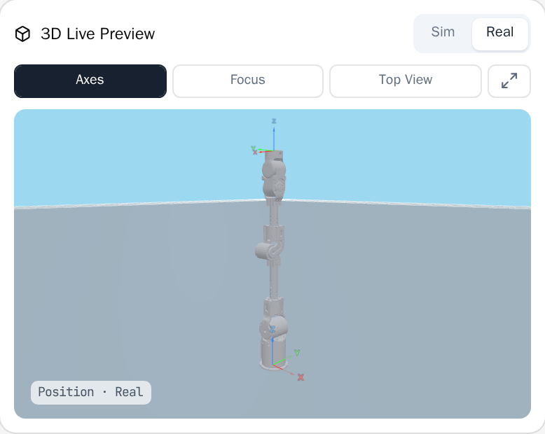
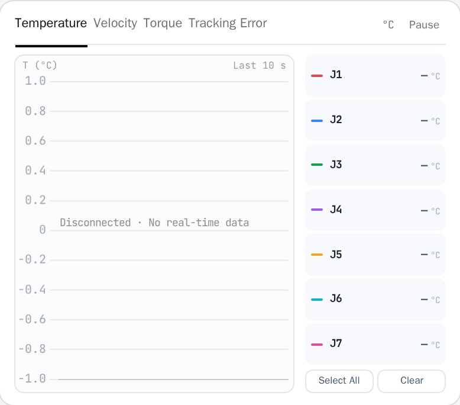
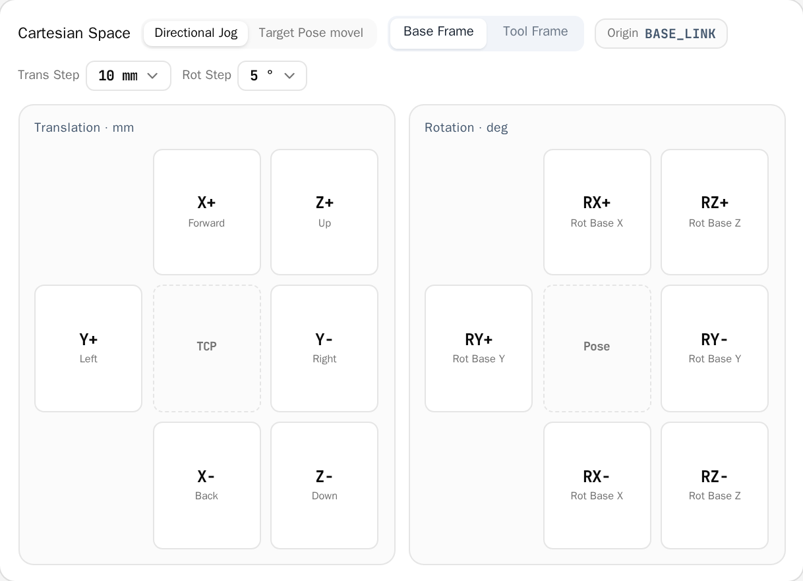
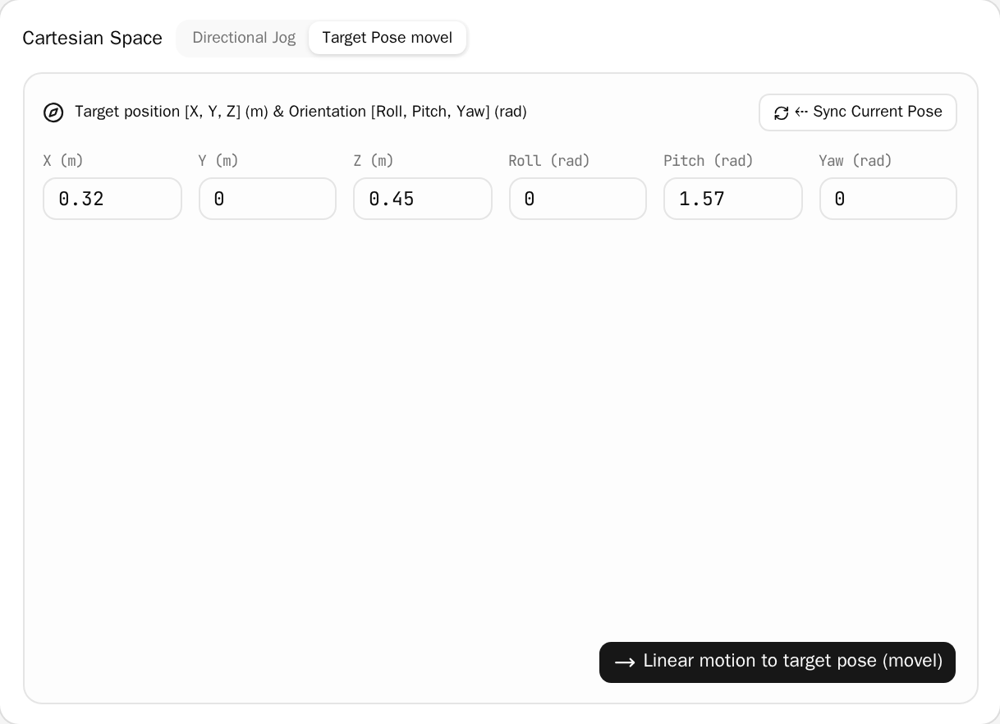

# LiteArm Studio User Manual

## 1. Introduction & Connection

> [!IMPORTANT]
> The robotic arm moves with inertia and force. Before enabling, commanding motions, or applying parameters, ensure the working envelope is clear of personnel and free of obstacles.

### 1.1 Overview

LiteArm Studio is the graphical host software for LiteArm 7-DoF (J1–J7) robotic arms. It provides real-time motion control, status monitoring, and system management.

The software is **one local program** (`litearm-studio-daemon`) plus **one browser UI**: the program owns the arm's USB serial port and serves the UI, which talks to it over the loopback interface. **There is no backend server, and no IP address to configure.**

```
Browser window (React UI, served by the local program)
   │ HTTP → static assets, /api/health
   │ WS   → state push / commands
   ▼
litearm-studio-daemon (listens on 127.0.0.1 only)
   ▼
STM32 firmware ──USB CDC (1d50:606f)──> CAN ──> motors
```

| Core Module | Key Features |
| :--- | :--- |
| Control | 3D pose monitoring & simulation, joint angle control, Cartesian jog & linear interpolation, mode switching, one-click homing |
| Telemetry | Joint telemetry sampling & recording, session details, CSV export |
| Settings | End-effector payload, gravity & inertia, gains & limits, diagnostics, gripper & bus, activation |
| Activation | Fill in a registration form once, before first use, to unlock the arm |

### 1.2 Install and run

Download the executable for your platform and verify it against the `.sha256` published next to it:

| Platform | File | How to run |
| :--- | :--- | :--- |
| Ubuntu / Debian | `litearm-studio-<version>_amd64.deb` | `sudo apt install ./litearm-studio-<version>_amd64.deb` |
| Windows | `litearm-studio-<version>-windows-amd64.exe` | Double-click |
| Other Linux | `litearm-studio-<version>-linux-amd64` | `chmod +x`, then run |

The `.deb` also installs a desktop entry and the udev rule that lets the logged-in user open the
arm's serial port. The standalone Linux file is not executable as downloaded, and it needs glibc
2.35 or newer (Ubuntu 22.04+, Debian 12+). [INSTALL.md](INSTALL.md) has the download commands, the
checksum verification, the serial-port permission and the first-run activation in full.

The program is self-contained: it needs no Python install and no browser — it opens its own embedded application window. That window belongs to the program, so **closing it quits the program** (the arm is de-energised and the serial port released); reloading the page does not quit. It prints the address it listens on, `http://127.0.0.1:8765/` by default; if that port is taken it picks the next free one and prints it — **use the printed address**.

> [!IMPORTANT]
> **On Linux the current user must be allowed to open the serial port** (the device node normally belongs to the `dialout` group), otherwise the UI opens but cannot reach the arm:
> ```bash
> sudo usermod -aG dialout "$USER"   # takes effect after you log in again
> ```
> Alternatively add a udev rule for VID:PID `1d50:606f` with mode `0666`.

### 1.3 Connecting to the arm

On start, the local program **finds the arm's USB CDC device automatically** (VID:PID `1d50:606f`) and opens a session as soon as it appears. The badge on the left of the top bar reports the state:

| Badge | Display | Meaning |
| :--- | :--- | :--- |
| Connected | Green dot · `<port> · <firmware>` | Session established; control and monitoring available |
| Connecting / Reconnecting | Gray / flashing · `Connecting…` | Session being established; the link retries automatically after a drop |
| Connect failed | Red dot · `Connect failed` | Device not found, firmware version mismatch, or link failure |

The **Connect / Disconnect** buttons on the top bar open or close the session by hand. **There is no IP address or port to fill in**; if the device appears at a non-default path, pass `--port`.

### 1.4 Activating the arm (required before first use)

> [!IMPORTANT]
> A new arm must be activated before it can move. Until then, pressing **Enable** does nothing. Everything else works.

Activation takes about a minute and is done once. Before you start, make sure the computer is online and the arm is connected.

1. Click **Settings**, then **Activation**.
2. If the page says **Activated**, this arm is already done.
3. If it says **Not activated**, fill in the form. Name, phone, organization, email and region are required; the rest is optional.
4. Tick the box to accept the *Activation Registration Consent*.
5. If the arm is enabled, press **Disable** on the control bar first. **The arm will sag under its own weight**, so hold it steady.
6. Press **Submit and activate** and wait a few seconds.

When the page says **Activated**, you can enable the arm.

**If something goes wrong:**

| Message | What to do |
| :--- | :--- |
| No credential for this machine | Press **Copy**, send the copied machine number to your supplier, and submit again once they confirm |
| Disarm first | Press **Disable** on the control bar, then submit again |
| Cannot reach the activation service | Check that the computer is online, then try again |
| Too many requests | Wait a few minutes and try again |
| Cannot read the device's license record | Check the USB cable and the arm's power, press **Refresh**, and try again |
| Firmware has no license feature | The arm's firmware is too old; upgrade it first (see §5.7) |
| Anything else | Press **Refresh** and see whether it now says **Activated**; if not, contact your supplier |

**Good to know:**

- Activation applies to this one arm. A second arm needs its own activation.
- Activation cannot be undone from the software.
- Activation is the only action in the application that uses the internet. It sends only what you typed into the form.

#### Real-time Health Metrics

The right side of the top bar continuously displays three live values, all read from the controller's state broadcast:

- Enable: Whether the joint drives are enabled (green "Enabled" / "Disabled");
- Run State: The controller's current state — "Ready", "Moving", "Zero Gravity", "Stopped", "Fault". A state string the firmware reports but the UI does not know is shown verbatim;
- Fault: System health indicator (green "None" / red "Yes").

Payload is not here: configure it under **Settings → Payload**. It is not part of the state broadcast.

---

## 2. User Interface Overview

LiteArm Studio consists of the left navigation rail, top status bar, and central workspace. Use the navigation rail to switch between functional modules.

---

## 3. Solo Control

The Solo Control page provides real-time 3D pose monitoring, state readouts, joint and Cartesian motion control, and LiteGrip gripper operation.

### 3.1 3D Robot Pose Viewport



- Mode Switching:
  - Real Mode: Model strictly reflects live joint positions broadcast from the robot;
  - Sim Mode: Preview motions in the interface without issuing commands to the arm;
- Navigation Controls: Left-drag to rotate view 360°, scroll wheel to zoom, right-drag to pan;
- Toolbar Actions (on the title row, next to the Real/Sim switch):
  - Axes: Toggle coordinate frames on joints and base;
  - Focus: Recenter camera on the robot;
  - Top View: Jump to top-down orthographic view;
  - Fullscreen: Open enlarged high-resolution viewport dialog.

### 3.2 Pose Monitor

Joint and Cartesian readings share one "Status" card, with both columns visible at once and four decimals each (0.0001 rad on the joints, 0.1 mm on the TCP):

- Joint Space (left column): Real-time angles for joints 1–7 (rad);
- Cartesian Space (right column): Tool Center Point (TCP) spatial coordinates (`X:`, `Y:`, `Z:` in meters) and Euler angles (`RX:`, `RY:`, `RZ:` in radians) relative to the base coordinate frame;
- When the firmware has no Cartesian planner the right column says so instead of showing an invented pose.

### 3.3 Live Telemetry Curve

Shows one real-time waveform at a time; you pick which metric it plots:



- Placement: the panel sits under "Current Pose" in the left column at a fixed height (about 10rem, scaling with the window's font size), enough for one readable chart;
- Metric Tabs: Switch between Temperature (°C), Velocity (rad/s), and Torque (Nm). The panel draws only the selected metric; the tabs are how you look at the others, instead of squeezing three charts together. The three tabs share the title row with the title and "Pause/Resume".
- Remembered Choice: The selected metric is restored the next time you open the control page; temperature is the default.
- Channel Filters: The joint list has its own row under the title row, one checkbox per joint. Tick a box to plot that joint, clear it to hide the curve; the checkbox accent matches the curve colour. "Select All" closes the row on the right.
- Hover Readout: Hovering the chart floats that moment's per-joint values and unit next to the cursor, two columns wide and colour-matched to the curves; it disappears when the pointer leaves. The readout floats above the panel, so the card never clips it.
- Current Readings: The J1–J7 numbers above the chart are the latest sample for the selected metric.

---

### 3.4 Control Bar & Modes

Consolidates global robot controls and operating mode selection:

#### Primary Controls

The first row of the control bar holds six buttons ordered by kind: the two state switches first (Enable / Zero Gravity), then the two fault-recovery commands (Reset / Clear Fault), then the two motion commands (Go Home / Ready Pose). Each button carries an icon from the gripper panel's set — power, feather, rotate, warning triangle, house, target — beside its label. Six across needs a wide window, so on a 1440-wide window the row folds into two rows of three; the buttons themselves do not change:

- Enable / Disable: Controls motor power and holding state. The label states what the next press does: **Enable** while the arm is released, **Disable** while it is energised. An energised arm turns that button into the row's only solid green (label and icon reversed out), so the current state is visible at a glance; the other five, Reset included, are outline buttons.
  - Click Enable: Energizes motors and locks current pose into ready state. While the arm is released or faulted, this press clears the drives' latched faults first, then energises;
  - Click Disable (the same button reads "Disable" while the arm is energised): cuts motor holding torque immediately; the arm will drop under gravity. Always support the arm or rest it on a secure surface before disabling;
- Zero Gravity: Press once to enter zero gravity (the button turns blue), press again to leave it and return to position mode. Support the arm before entering; on exit it re-locks the current pose at high stiffness;
- Reset: Resets the controller (firmware `0x14 reset`) — clears latched faults and re-anchors the trajectory reference to the current measured pose. It is not a full reboot, and it does not also send Clear Fault;
- Clear Fault: Clears the latched fault bits in each drive's RAM (firmware `0x13 clear_faults`: overcurrent, overtemperature, overvoltage, undervoltage). It does not write flash. Press it first once the obstruction or overheating is resolved and the drives have cooled;
- Go Home: Smoothly moves all axes to the upright zero point (all joints at 0 rad), typically used for initial calibration or recovery;
- Ready Pose: Smoothly moves all axes to the default operating configuration, serving as an ideal baseline for operations;
- STOP (Emergency Stop): Immediately aborts all ongoing motions and locks the arm in place. In case of personnel danger or equipment collision, cut main power immediately.

**Do not** use Reset or Clear Fault as a stop button: the firmware counts both `0x13` and `0x14` as commands that discard the in-flight Cartesian plan (`cart_invalidate_before_motion()`), so pressing either silently drops the linear move that is currently running. Use STOP to stop; the two fault commands only exist to clear a latched alarm after its cause is gone.

#### Operational Modes

- Position Mode: Standard closed-loop servo control mode, high-stiffness position hold, precisely executing joint micro-stepping or Cartesian trajectory commands. This is the mode whenever zero gravity is off;
- Zero Gravity Mode: Enables dynamic gravity compensation and zero-force teaching algorithms; motors cancel arm gravity in real time, allowing smooth manual lead-through by hand. The control bar's Zero Gravity button toggles it, and the badge at the bottom-left of the 3D preview shows the active mode (for example "Zero Gravity · Real");
- Global Speed Scale: Its own row; the `−` / `+` stepper at the right end of the slider nudges it by 1%. Range 1%–100% across all motions (mapped to underlying driver and planner speed scaling).

---

### 3.5 Joint Space Control

- J1–J7 Independent Sliders: Mapped to joint limits, displaying real-time percentages and radian values;
- Nudge Buttons: Single-step micro adjustments (`◀` / `▶`) per joint;
- Send on Release:
  - Checked (default): Command is issued immediately when releasing the slider; the "Send" button in the panel header is greyed out but stays in place;
  - Unchecked: Staging mode; adjust multiple sliders and click "Send" to execute a coordinated multi-joint motion.

---

### 3.6 End-effector Trim (Cartesian Space)

Supports spatial pose adjustments referenced to the end-effector tool:

#### Directional Jog



- Reference Frame:
  - Base: Grounded to the robot mounting base;
  - Tool: Dynamic reference aligned with tool TCP orientation;
- Translation Pad (a cross): the top pair is `Z+ / Z−` (up/down), the vertical axis is `X+ / X−` (forward/back) and the horizontal axis is `Y+ / Y−` (left/right). Long-press for continuous linear moves; stop on release. Step size 1 / 5 / 10 / 25 / 50 mm, chosen on the title row;
- Rotation Pad (the same cross): the top pair is `RZ+ / RZ−`, the vertical axis is `RY− / RY+` and the horizontal axis is `RX+ / RX−`. Long-press to rotate around the TCP; stop on release. Step size 1 / 5 / 10 / 15 / 30°;
- Two cards side by side: the end-effector trim card on the left holds the jog pads and the linear-motion card on the right holds the absolute pose inputs, with no sub-mode tabs to switch between;
- Reference frame: `Base Frame / Tool Frame` lives on the title row and already says which frame is in use, so the separate origin badge is gone.

#### Linear Motion to a Target Pose



- Target Pose Input: Enter target `X, Y, Z` coordinates (m) and `Roll, Pitch, Yaw` angles (rad);
- Sync Current: Populate inputs with live TCP pose for precision fine-tuning;
- Execute: the end effector travels the **straight line** from its start to the target (firmware `0x3A`, a Cartesian straight move) and the orientation is interpolated along the shortest arc; the start is the live measured TCP, not the values in the fields;
- ⚠ The firmware accepting the command does not mean the arm stopped on the target: a later motion can supersede the trajectory, so read the live TCP in the Status card for the real landing point.

---

### 3.7 LiteGrip Gripper

The LiteGrip two-finger parallel gripper shares the arm's CAN bus and fills the control page's right column below the E-stop. It has its own connection, enable and stop controls; the CAN channel, mounting, calibration and travel are configured in **Settings → Gripper & bus** (§5.4), and the panel repeats the channel and CAN ID as one line of monospace text at the bottom.

- Connect / Disconnect: open or close the gripper session. **Connect** is available only when the program reports a gripper session — the Linux daemon has one, the Windows build does not;
- Enable / Disable: energise or release the gripper drive. Opening, closing and calibration need the drive enabled;
- Opening: the slider sets the target opening in millimetres and sends it on release; the live reading sits next to the panel title;
- Open / Close: drive to the open or closed mechanical stop;
- Grasp: close with the **target force** limit, so a fragile part is not crushed;
- Zero gravity: release the drive so the jaws can be moved by hand;
- Stop / Release Stop / Clear Fault: stop immediately, release a latched stop, and clear a drive fault;
- Gripper parameters (collapsed by default): **target force** (0–40 N) and **move speed** (5–150 mm/s);
- Calibration: the panel names the calibration in effect (measured, nominal template, or factory fallback). With the nominal template it refuses millimetre targets until you run the zero calibration.

## 4. Telemetry

The Telemetry page manages sampled motion telemetry.

### 4.1 Telemetry Sampling & Session History

Telemetry recording begins automatically upon connection, saving 10 Hz samples of joint angles, velocities, torques, temperatures, and fault states locally.

- Session List: Chronologically displays recording sessions with start time, duration, sample count, and storage size;
- Detailed Inspection: Expand any session to inspect per-timestamp joint angles, velocities, torques, and driver temperatures;
- Storage Retention Limit:
  - Click the "Retention: N MB" edit button at the top;
  - Configure storage quota between 10 MB and 500 MB;
  - Oldest sessions are pruned automatically upon reaching quota.

### 4.2 CSV Data Export

Click "Export CSV" to download the full time-series telemetry data as a `.csv` file for analysis in MATLAB, Python (Pandas), or Excel.

### 4.3 Link Diagnostics

The current version has no separate "Controller Logs" page. For link health, use **Settings → Diagnostics → Firmware self-test**: it runs a kinematics self-test and reports the link diagnostic counters (CRC errors, dropped FIFO frames) — those are the first numbers to move when the USB link misbehaves. Overall runtime metrics live in the top bar (enable, run state, fault state).

---

## 5. System & Algorithm Settings

The Settings page is organised into seven tabs: **Payload / Gravity & Inertia / Gains & Limits / Diagnostics / Gripper & Bus / Activation / Firmware update** (activation is covered in §1.4, the firmware update in §5.7).

### 5.1 Payload

Configure the tool/workpiece mass and centre of mass used by the firmware's gravity feed-forward.

- **Mass** (kg) and **centre of mass X / Y / Z** (metres, relative to the tool flange), corresponding to feed-forward items 4 and 5;
- ⚠ The firmware **silently clamps** these values (mass to ≥ 0, centre of mass to ±1 m) instead of rejecting them, so the "effective" line on the panel is the truth — it is what was read back after writing.

---

### 5.2 Gravity & Inertia

- **Per-joint gravity scale**: the feed-forward gain for each joint; `1.0` is the firmware default;
- **Per-joint inertia scale**: the inertia term on the same feed-forward channels;
- **Gravity direction**: the gravity unit vector in the base frame (feed-forward scalar item 6);
- ⚠ The firmware's feed-forward vector is fixed at **7 channels**. When the arm reports fewer axes, the panel draws only the existing channels, but **saving still writes all 7 values**.

---

### 5.3 Gains & Limits

- **Per-joint gains and soft limits**: MIT stiffness / damping / torque clamp for each joint, plus the soft limits `q_min` / `q_max` (rad) that set the slider range on the control page;
- **Persist to flash**: the firmware only allows flash writes while the arm is **disarmed**; it refuses while enabled;
- **Restore factory**: resets every parameter to the factory default. This cannot be undone.

---

### 5.4 Gripper & Bus

Configure the LiteGrip gripper on this CAN channel: **channel, CAN ID, mounting orientation, calibration file and measured travel**.

- Calibration comes from one of two sources: the **nominal template** (shipped with the SDK; it only declares the mounting orientation and nominal geometry and has never been measured on this machine — so millimetre targets are refused until you run a zero calibration) or a **measured calibration**;
- The mounting orientation must match the actual wiring; the panel says so explicitly when the declared and actual orientations disagree;
- The per-channel **travel record** is what every millimetre reading on screen is computed from; it must survive a restart;
- To import a measured calibration you can type its path, or press **Browse…** to open a picker over the **control machine's** filesystem (the machine running the local program, not the one in front of you). It opens in the folder of the path you typed, navigates with Up/Home, shows each `*.json`'s validation result on its row, and fills the path box when you pick one. Browsing needs no connection; importing does.

---

### 5.5 Diagnostics

- **Firmware self-test**: runs a kinematics self-test and reports the **link diagnostic counters** (CRC errors, dropped FIFO frames) — the first numbers to move when the USB link misbehaves;
- Overall runtime metrics live in the **top bar**: enable, run state and fault state.

---

### 5.6 Activation

See §1.4 for the activation steps.

---

### 5.7 Firmware update

> [!IMPORTANT]
> The arm is disabled during an upgrade and the emergency stop is unavailable. Before you start, make sure the arm is supported and nobody is within reach.

Get the firmware file (`.hex` or `.bin`) from your supplier first, and check that:

- the computer is connected to the arm over USB and the top bar reads Connected;
- the status badge at the top of the page reads Ready;
- you will not unplug USB or cut power during the upgrade.

**Steps:**

1. Click **Settings**, then **Firmware update**.
2. Click **Choose a firmware file** and pick the file from your supplier.
3. Check the version in the **Image summary**.
4. Read the confirmation notes and tick **I confirm the arm is in a safe state**.
5. Click **Start update** and wait for the progress bar to finish.

The page then reports that the update finished and shows the device's current version. You can press **Cancel update** before the firmware starts being written; after that it cannot be cancelled.

**If something goes wrong:**

| Message | What to do |
| :--- | :--- |
| Controller not connected | Connect the arm, then upgrade |
| Flashing engine unavailable | This machine has no usable USB flashing engine. pyusb and libusb are required, and Windows also needs ST's WinUSB driver; if they are all present, contact your supplier |
| This firmware image cannot be used | Wrong file; get the correct one from your supplier |
| The arm is not disabled; aborted | Press **Disable** on the control bar and retry. The arm will sag under its own weight, so hold it steady |
| DFU device not found | Check the USB cable and retry; Windows also needs ST's WinUSB driver |
| Cannot open the DFU device (permission denied) | Linux only. Add the udev rule `SUBSYSTEM=="usb", ATTR{idVendor}=="0483", ATTR{idProduct}=="df11", MODE="0666"`, replug USB, and retry |
| Flashing failed | Retry; if it keeps failing, contact your supplier |
| Firmware written but the controller did not reconnect | Replug the USB cable and click **Connect** on the top bar |

**Good to know:**

- An upgrade does not change activation or factory calibration data.
- Use only firmware files supplied by your supplier.

---

## 6. Operational Safety Rules & Troubleshooting

### 6.1 Operational Safety Rules

1. Pre-Motion Check: Confirm the arm is connected (the top bar shows **port · firmware**), **already activated** (see §1.4), and free of faults, before enabling;
2. Drop Prevention: Always support the arm manually before disabling power;
3. Zero-Gravity Drag: Guide smoothly without violent whipping; keep hands clear of joint pinch points;
4. Emergency Stop (STOP): Use software STOP for immediate motion abort; cut power supply immediately in critical danger;
5. Configuration Integrity: Do not modify low-level system configuration files or firmware without authorization.

---

### 6.2 Troubleshooting Matrix

| Issue | Probable Cause | Recommended Action |
| :--- | :--- | :--- |
| Top bar shows "Connect Failed" | 1. Arm not powered, or the USB cable is loose<br>2. The device did not enumerate as `1d50:606f`<br>3. On Linux the current user lacks serial permission<br>4. Another process holds the serial port | 1. Check the USB cable and controller power<br>2. Confirm enumeration: `lsusb` should list `1d50:606f` on Linux, a COM port on Windows<br>3. On Linux, add the user to `dialout` and log in again (see §1.2)<br>4. Close the other program, or pass `--port` explicitly |
| **"Enable" does nothing** | The arm has not been activated yet | Follow §1.4. Everything except Enable works in the meantime |
| Activation shows an error | The message and its fix are listed in the table in §1.4 | Follow that table; if the consent box was not ticked, tick it and submit again |
| "Arm is moving, please wait" | In-flight motion in progress; mutex guard active | Normal safety behavior; wait for move completion or click STOP |
| Red fault indicator: "Joint N Fault" | Collision obstruction, overcurrent, or driver overtemperature (>80°C) | 1. Clear physical obstructions and allow cooling<br>2. Click **Clear Fault** on the control bar<br>3. If it does not clear, click **Reset**<br>4. Still faulted: support the arm, disable, and re-enable |
| "Controller in fault state" | Safety protection triggered (overspeed, boundary limit, communication timeout) | Clear Fault only clears latched drive alarms and Reset only resets the controller; neither guarantees a release. Support the arm, disable and re-enable. If it does not recover, restart the local program |
| Gripper shows "Disconnected" | Cable loose, device offline, or power drop | 1. Check the end-effector connector<br>2. Click **Connect** in the gripper panel<br>3. Click **Clear Fault** once the cause is gone |
| No telemetry recorded | Arm is not in "Connected" status | Telemetry starts automatically upon live connection |
