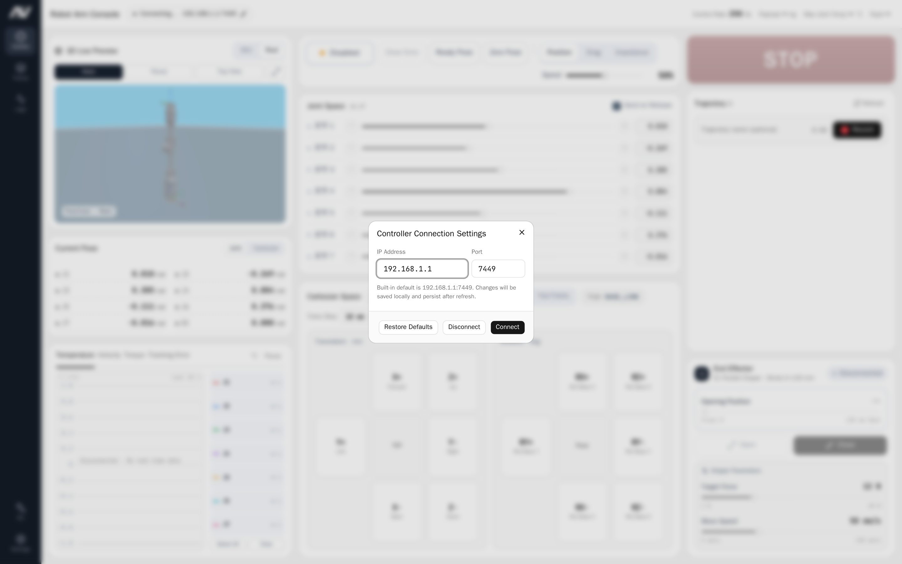
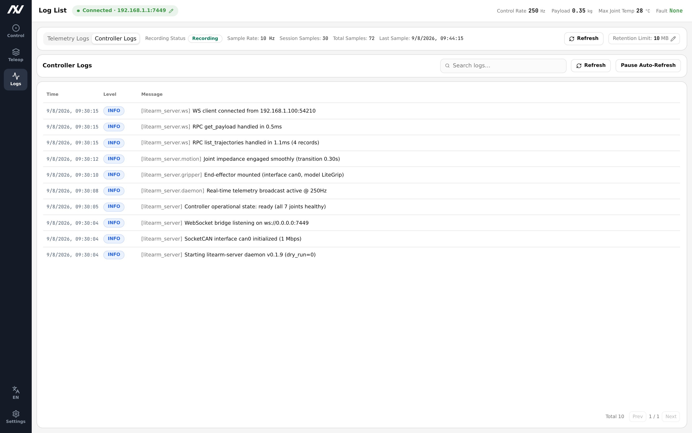
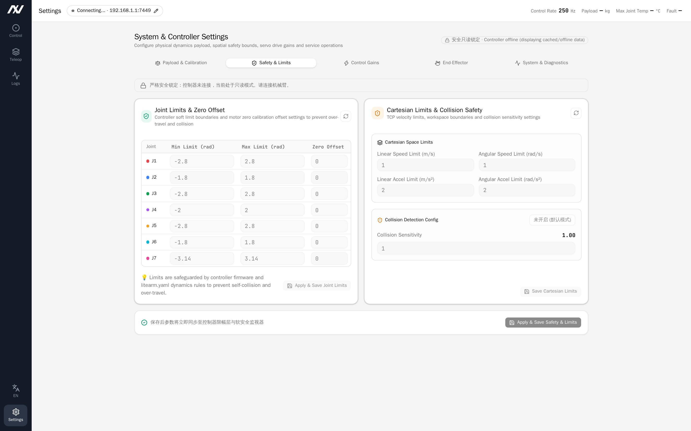
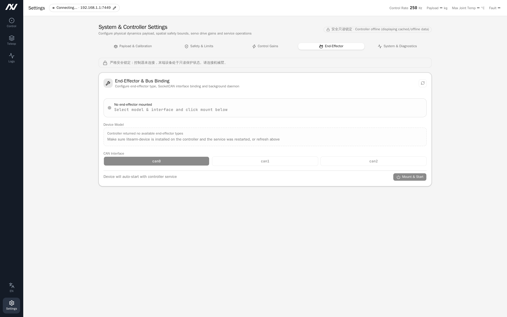
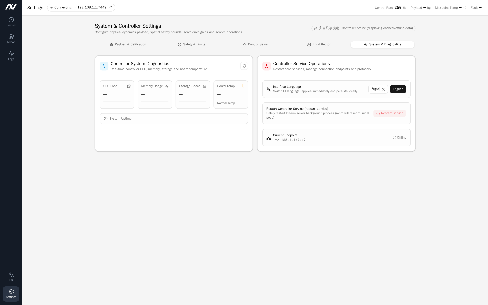

# LiteArm Studio User Manual

## 1. Introduction & Connection

> [!IMPORTANT]
> The robotic arm moves with inertia and force. Before enabling, commanding motions, or applying parameters, ensure the working envelope is clear of personnel and free of obstacles.

### 1.1 Overview

LiteArm Studio is the graphical host software designed for LiteArm 7-DoF (J1–J7) robotic arms. Connecting to the backend control service (`litearm-server`), it provides real-time motion control, trajectory teaching, status monitoring, and system management.

| Core Module | Key Features |
| :--- | :--- |
| Control | 3D pose monitoring & simulation, joint angle control, Cartesian jog & linear interpolation, mode switching, one-click homing |
| Trajectory | Zero-gravity manual lead-through teaching, trajectory library, multi-speed & loop playback, safe takeover |
| Logs & Telemetry | Joint telemetry sampling & recording, session details & CSV export, backend runtime log search |
| Settings | End-effector payload calibration, mounting orientation & gravity scaling, safety limits, servo gains, end-effector device mounting, and system maintenance |

### 1.2 Desktop Application Packages

LiteArm Studio is distributed as pre-packaged standalone desktop applications:

- Windows: Run the native setup wizard (`LiteArm Studio-Setup-<version>.exe`) to install and launch;
- Linux / Ubuntu: Standard Debian package (`.deb`) or standalone executable (`.AppImage`).

### 1.3 Connecting to the Backend Service

Upon launch, the software attempts to connect to the configured backend endpoint (default port `7449`). The connection badge at the top left provides instant feedback on link status:

| Badge Status | Display & Color | Description |
| :--- | :--- | :--- |
| Connected | Green Dot · `Connected · <IP:Port>` | Connection is healthy. Full control and monitoring are active. |
| Connecting / Reconnecting | Gray/Flashing · `Connecting…` | Connecting in progress, or automatically attempting reconnect after disconnect. |
| Disconnected / Error | Red Dot · `Connect Failed · <Reason>` | Service not running, CAN interface down, or invalid IP/port configured. |

#### Configuring Connection Endpoint

1. Click the connection badge on the left of the top status bar to open the "Controller Connection Settings" dialog;
2. Enter the backend service IP Address and Port (default port is `7449`):
   - Single-Machine Mode: The service runs locally; keep IP as `127.0.0.1` and port `7449`;
   - Dedicated Host Mode: The service runs on an independent IPC or compute box; enter its LAN IP address;
3. Click "Connect" or press Enter. The configuration is saved locally and restored automatically on subsequent launches.

#### Real-time Health Metrics

The right side of the top bar continuously displays core operational metrics:

- Control Frequency: Underlying real-time loop frequency (nominal ~250 Hz);
- Payload: Currently configured and active end-effector tool/workpiece mass (kg);
- Max Joint Temp: Highest recorded temperature across joint drivers (°C);
- Fault Status: System health indicator (Green "Normal" / Red "Fault").

---

## 2. User Interface Overview

LiteArm Studio consists of the left navigation rail, top status bar, and central workspace. Use the navigation rail to switch between functional modules.

---

## 3. Solo Control

The Solo Control page provides real-time 3D pose monitoring, state readouts, joint and Cartesian motion control, trajectory teaching, and end-effector gripper or dexterous hand operations.

### 3.1 3D Robot Pose Viewport

- Mode Switching:
  - Real Mode: Model strictly reflects live joint positions broadcast from the robot;
  - Sim Mode: Preview motions in the interface without issuing commands to the arm;
- Navigation Controls: Left-drag to rotate view 360°, scroll wheel to zoom, right-drag to pan;
- Toolbar Actions:
  - Axes: Toggle coordinate frames on joints and base;
  - Focus: Recenter camera on the robot;
  - Top View: Jump to top-down orthographic view;
  - Fullscreen: Open enlarged high-resolution viewport dialog.

### 3.2 Pose Monitor

Displays real-time joint and end-effector pose readings:

- Joint Space: Real-time angles for all seven axes J1–J7 (rad);
- Cartesian Space: Tool Center Point (TCP) spatial coordinates (`X, Y, Z` in meters) and Euler angles (`Roll, Pitch, Yaw` in radians) relative to the base coordinate frame.

### 3.3 Live Telemetry Curve

Shows one real-time waveform at a time; you pick which metric it plots:

- Metric Tabs: Switch between Temperature (°C), Velocity (rad/s), Torque (Nm), and Tracking Error (rad). The panel draws only the selected metric, at full height — the right column is not tall enough for four readable charts.
- Remembered Choice: The selected metric is restored the next time you open the control page; temperature is the default.
- Channel Filters: Select or deselect J1–J7 curves individually, with "Select All", "Clear", and "Pause/Resume" controls.
- Current Readings: The J1–J7 numbers next to the metric name are the latest sample for the selected metric. Tracking error reads "no real-time data" because the controller broadcast does not carry it.

---

### 3.4 Control Bar & Modes

Consolidates global robot controls and operating mode selection:

#### Primary Controls

- Enable / Disable: Controls motor power and holding state.
  - Click Enable: Energizes motors and locks current pose into ready state;
  - Click Disable: Prompts for confirmation. Note: Disabling cuts motor holding torque; the arm will drop under gravity. Always support the arm or rest it on a secure surface before disabling;
- Clear Fault: Resets driver error alarms (such as overcurrent or overtemperature). Once all joints are healthy, the arm automatically returns to ready state;
- Ready Pose: Smoothly moves all axes to the default operating configuration, serving as an ideal baseline for operations;
- Zero Position: Smoothly moves all axes to the upright zero position (all joints at 0 rad), typically used for initial calibration or recovery;
- STOP (Emergency Stop): Immediately aborts all ongoing motions and locks the arm in place. In case of personnel danger or equipment collision, cut main power immediately.

#### Operational Modes

- Position Mode: Standard closed-loop servo control mode, high-stiffness position hold, precisely executing joint micro-stepping or Cartesian trajectory commands;
- Drag Mode: Enables dynamic gravity compensation and zero-force teaching algorithms; motors cancel arm gravity in real time, allowing smooth manual lead-through by hand;
- Impedance Mode: Compliant joint impedance control with tunable virtual stiffness and damping, buffering external contacts to enhance human-robot collaboration safety;
- Global Speed Scale: Slider adjusting global speed ceiling from 1% to 100% across all motions (mapped to underlying driver and planner speed scaling).

---

### 3.5 Joint Space Control

- J1–J7 Independent Sliders: Mapped to joint limits, displaying real-time percentages and radian values;
- Nudge Buttons: Single-step micro adjustments (`◀` / `▶`) per joint;
- Send on Release:
  - Checked (default): Command is issued immediately when releasing the slider;
  - Unchecked: Staging mode; adjust multiple sliders and click "Send" to execute a coordinated multi-joint motion.

---

### 3.6 Cartesian Space Control

Supports spatial pose adjustments referenced to the end-effector tool:

#### Directional Jog

- Reference Frame:
  - Base: Grounded to the robot mounting base;
  - Tool: Dynamic reference aligned with tool TCP orientation;
- Translation Pad: Long-press `Forward / Backward / Left / Right / Up / Down` buttons for continuous linear moves; stop on release. Step sizes: 1 / 5 / 10 / 25 / 50 mm;
- Rotation Pad: Long-press rotation buttons (around X / Y / Z axes) to rotate around TCP; stop on release. Step sizes: 1 / 5 / 10 / 15 / 30°.

#### Linear Move to Target Pose

- Target Pose Input: Enter target `X, Y, Z` coordinates (m) and `Roll, Pitch, Yaw` angles (rad);
- ⇠ Sync Current: Populate inputs with live TCP pose for precision fine-tuning;
- Execute: Plans a linear interpolation trajectory to smoothly move the arm to the target pose.

---

### 3.7 Trajectory Lead-Through Teaching & Playback

Teach complex operational motions intuitively by dragging:

#### Recording Workflow

1. Enter a trajectory name (e.g., `pick_and_place_01`);
2. Click "Start Recording"; the arm automatically switches to zero-gravity drag mode and records poses;
3. Manually guide the arm through the desired motion sequence;
4. Click "Stop & Save"; the trajectory file is saved to the backend host.

#### Playback Controls

- Select Trajectory: Expand trajectory card to view duration and sampled point count;
- Speed Scale: Choose 0.25×, 0.5×, 1.0×, or 2.0× speed (actual speed = global speed × scale);
- Loop: Toggle continuous looped execution;
- Play / Stop: Click "Play" to start; manual controls lock during playback to prevent collisions;
- Takeover / Abort: Click "Takeover" or STOP to halt playback immediately and restore manual control;
- Delete: Click trash icon to remove trajectory.

---

### 3.8 End-Effector (Grippers & Hands)

The system natively supports electric parallel grippers and multi-DoF dexterous hands. Attached tools are detected automatically to open specialized control panels:

- Electric Parallel Gripper Control:
  - Stroke & Opening: Continuously adjust target stroke via slider; the jaws move smoothly upon release;
  - Quick Actions: "Open" and "Close" buttons for rapid full-stroke clamping;
  - Clamping Force: Set clamping force limits (1–40 N) to safeguard fragile parts;
  - Travel Speed: Configure jaw opening/closing velocity (5–150 mm/s);
  - Clear Fault: Reset stall or overcurrent alarms with a single click.
- Multi-DoF Dexterous Hand Control:
  - Independent finger joint angle and bending commands;
  - Preset grasp gestures (fist, open, pinch, etc.) for rapid recall;
  - Real-time thermal and torque monitoring across finger actuators.

## 4. Telemetry & System Logs

The Logs page manages sampled motion telemetry and system diagnostic logs.

### 4.1 Telemetry Sampling & Session History

Telemetry recording begins automatically upon connection, saving 10 Hz samples of joint angles, velocities, torques, temperatures, and fault states locally.

- Session List: Chronologically displays recording sessions with start time, duration, sample count, and storage size;
- Detailed Inspection: Expand any session to inspect per-timestamp joint angles, velocities, torques, and driver temperatures;
- Storage Retention Limit:
  - Click the "Retention: N MB" edit button at the top;
  - Configure storage quota between 10 MB and 500 MB;
  - Oldest sessions are pruned automatically upon reaching quota.

### 4.2 CSV Data Export

Click "Export CSV" to download the full time-series telemetry data as a `.csv` file for analysis in MATLAB, Python (Pandas), or Excel.

### 4.3 Backend Runtime Logs

Switch to the "Controller Logs" tab to stream diagnostic logs from `litearm-server`:

- Log Levels: Labeled DEBUG, INFO, WARNING, ERROR, CRITICAL;
- Keyword Filter: Search for terms like `gripper`, `motion`, or `fault` for instant filtering;
- Auto-Refresh: Polls for new logs every 5 seconds; toggle with "Pause" or click "Refresh".

---

## 5. System & Algorithm Settings

The Settings page provides dynamics calibration, safety limits, servo gains, and maintenance tools.

### 5.1 Payload & Mounting Calibration

Accurate payload and mounting calibration is required for gravity compensation and lead-through teaching.

- End-Effector Payload:
  - Enter tool and workpiece Mass (kg);
  - Enter center-of-mass offset (X, Y, Z) in meters relative to the tool flange;
  - Presets: `No Load`, `0.25 kg`, `0.5 kg`; click "Apply & Save Payload".
- Mounting Pose & Gravity Calibration:
  - Base Euler Angles (Base RPY): Presets for `Standard (0,0,0)`, `Inverted (π,0,0)`, and `Side Wall (0,π/2,0)`, with fine-tuning for Roll, Pitch, and Yaw (rad); click "Update Mounting Pose";
  - Joint Gravity Scale: Adjust gravity compensation scale per joint J1–J7 (range 0–10, default 1.0); changes take effect with a smooth 2-second ramp; click "Restore All 1.0" to reset.

---

### 5.2 Safety Limits & Boundaries

Inspect and configure physical boundaries and collision thresholds.

- Joint Limits & Zero Offsets: Configure lower limit, upper limit (rad), and zero offset per joint J1–J7;
- Cartesian Limits & Collision Protection: Set maximum linear velocity, angular velocity, linear acceleration, angular acceleration ceilings, and collision sensitivity;
- Limits are enforced by firmware and dynamics configuration to prevent mechanical overtravel and collision.

---

### 5.3 Servo Driver Gains & Fault Clearing

Gain tuning and diagnostic tools for all seven servo drivers:

- PD Gains: Displays position proportional gain Kp and derivative damping gain Kd per axis, with stiffness presets for Compliant (0.6x), Standard (1.0x), and High Stiffness (1.5x);
- Restore Factory PD Gains: Resets gains to calibrated defaults in case of vibration or insufficient stiffness;
- Fault Clearing & E-Stop Release: Broadcasts clear-fault commands to drivers, or releases software lock states.

---

### 5.4 End-Effector Device Management

Manage attached end-effector tools and communication bus binding:

- Device Selection: Supports electric parallel grippers and multi-DoF dexterous hands;
- Bus Interface Binding: Select the SocketCAN interface (e.g. `can0`);
- Mount & Lifecycle: Click "Mount & Start" to launch the background daemon, or "Unmount Device" when swapping tools.

---

### 5.5 System Monitoring & Service Maintenance

Monitors host hardware vitals and manages background daemon services:

- Hardware Vitals:
  - Host CPU utilization percentage;
  - RAM memory usage;
  - Free disk storage;
  - Motherboard temperature (warns above 70°C);
  - System uptime;
- Restart Backend Service:
  - Restarts the `litearm-server` daemon on the host;
  - The connection disconnects briefly and reconnects automatically within seconds;
  - Note: The arm reinitializes and enters hold state upon service restart. Only perform this when the robot is stationary and in a safe configuration.

---

## 6. Operational Safety Rules & Troubleshooting

### 6.1 Operational Safety Rules

1. Pre-Motion Check: Verify clear workspace and ensure no obstacles or personnel are present before enabling;
2. Drop Prevention: Always support the arm manually before disabling power;
3. Zero-Gravity Drag: Guide smoothly without violent whipping; keep hands clear of joint pinch points;
4. Emergency Stop (STOP): Use software STOP for immediate motion abort; cut power supply immediately in critical danger;
5. Configuration Integrity: Do not modify low-level system configuration files or firmware without authorization.

---

### 6.2 Troubleshooting Matrix

| Issue | Probable Cause | Recommended Action |
| :--- | :--- | :--- |
| Top bar shows "Connect Failed" | 1. Local `litearm-server` service not running or failed 2. USB-CAN adapter disconnected or `can0` down 3. Incorrect endpoint IP/Port (direct CAN default is `127.0.0.1:7449`) | 1. Check service status: `sudo systemctl status litearm-server-bin` 2. Check USB-CAN adapter and power wiring 3. Click badge, verify IP (`127.0.0.1`) and port `7449` 4. (If over LAN) Check network ping and firewall port `7449` |
| "Arm is moving, please wait" | In-flight motion in progress; mutex guard active | Normal safety behavior; wait for move completion or click STOP |
| Red fault indicator: "Joint N Fault" | Collision obstruction, overcurrent, or driver overtemperature (>80°C) | 1. Clear physical obstructions and allow cooling 2. Click "Clear Fault" on control bar 3. If persistent, support arm, disable, and re-enable |
| "Controller in fault state" | Safety protection triggered (overspeed, boundary limit, communication timeout) | System-level safety protection triggered; support arm, disable and re-enable, or restart backend service |
| Gripper shows "Disconnected" | Cable loose, device offline, or power drop | 1. Check end-effector aviation connector 2. Reconnect arm in Studio to trigger auto-reconnect 3. Click "Clear Fault" in Gripper panel |
| Trajectory list empty | 1. In Simulation mode 2. No files saved on backend host | 1. Switch to "Real" mode and connect 2. Record a new trajectory |
| No telemetry recorded | Arm is not in "Connected" status | Telemetry starts automatically upon live connection |
