# LiteArm Studio 操作手册

## 1. 软件简介与连接

> [!IMPORTANT]
> 机械臂运动具备一定惯性与力量。在使能、控制运动或下发参数前，必须确保机械臂工作范围内无人员驻留、无障碍物干涉。

### 1.1 软件简介

LiteArm Studio 是 LiteArm 七自由度（J1–J7）机械臂的图形化上位机软件，连接后端控制服务（`litearm-server`），提供实时运动控制、轨迹示教、状态监控及系统管理能力。

| 核心模块 | 主要功能 |
| :--- | :--- |
| 单臂控制 | 3D 姿态监控与仿真、关节角度控制、笛卡尔空间点动与直线插补、控制模式切换、一键回零位 |
| 轨迹示教 | 零重力手动拖拽示教录制、轨迹库管理、多倍速与循环回放、中途安全接管 |
| 遥测与日志 | 关节遥测数据采样记录、会话明细与 CSV 导出、后端运行日志检索 |
| 系统设置 | 末端负载校准、安装姿态与重力标定、安全限位、驱动增益、末端设备挂载及系统运维 |

### 1.2 客户端安装与运行

- Windows：运行 `LiteArm Studio-Setup-<版本号>.exe` 安装包完成安装并启动；
- Linux / Ubuntu：提供标准 Debian 安装包（`.deb`）或免安装运行包（`.AppImage`）。

### 1.3 连接后端服务

软件启动后自动连接后端控制服务（默认端口 `7449`）。顶栏左侧连接状态徽标实时反馈通信状态：

| 徽标状态 | 颜色与显示 | 说明 |
| :--- | :--- | :--- |
| 已连接 | 绿色圆点 · `已连接 · <IP:Port>` | 通信正常，可进行控制与监控 |
| 连接中 / 重连中 | 灰色/闪烁 · `连接中…` | 正在建立连接；断线后自动重试 |
| 未连接 / 连接失败 | 红色圆点 · `连接失败 · <原因>` | 服务未运行、CAN 接口未就绪或 IP/端口配置错误 |

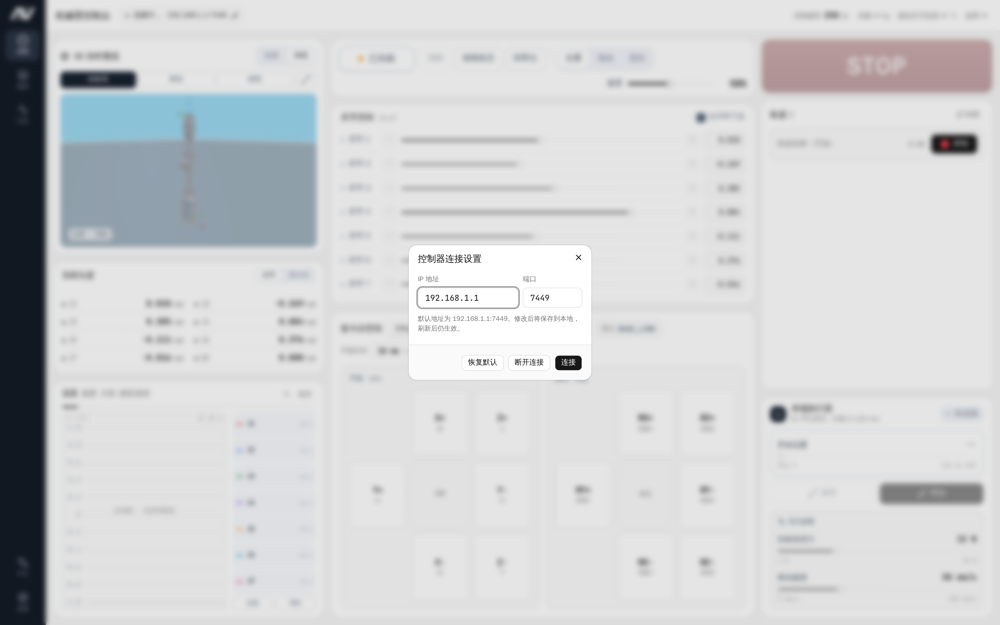

#### 配置网络端点

1. 点击顶栏左侧连接状态徽标，打开「控制器连接设置」对话框；
2. 输入后端控制服务的 IP 地址与端口（固定为 `7449`）：
   - 单机直连模式：控制服务运行在本机，IP 填写 `127.0.0.1`，端口保持 `7449`；
   - 独立主机模式：控制服务运行在独立工控机或计算盒上，填写该主机的实际局域网 IP 地址；
3. 点击「连接」按钮保存，配置将持久化保存在本机，下次启动自动连接。

#### 顶部实时运行指标

顶栏右侧显示机械臂核心运行指标：

- 控制频率：底层控制循环实时频率（标称约 250 Hz）；
- 负载：当前已生效的末端负载质量（kg）；
- 最高关节温度：各关节驱动器的当前最高温度（°C）；
- 故障状态：运行健康度（绿色「无故障」/ 红色「存在故障」）。

---

## 2. 界面布局总览

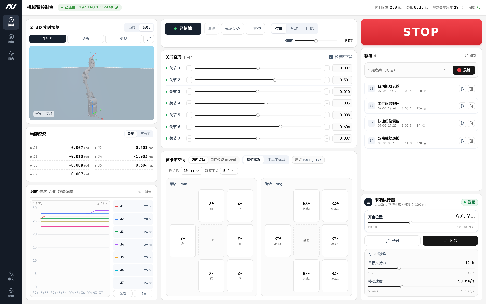

LiteArm Studio 包含左侧导航栏、顶部状态栏与中央主工作区，点击左侧导航栏可在各功能模块之间快速切换。

---

## 3. 单臂控制

「单臂控制」页面提供机械臂 3D 姿态监控、实时状态读数、关节与笛卡尔空间运动控制、轨迹示教及末端夹爪与灵巧手操作。

### 3.1 3D 机械臂姿态实时视口

- 模式切换：
  - 实机模式：模型同步机械臂实时关节角度；
  - 仿真模式：仅在界面中预览姿态，不下发真机动作；
- 视口交互：鼠标左键按住拖拽旋转视角，滚轮缩放，右键按住拖拽平移视口；
- 快捷工具栏：
  - 坐标系：开启/关闭各关节与基座的坐标轴辅助线；
  - 聚焦：重置视口中心至机械臂主体；
  - 俯视：切换至正上方俯视视角；
  - 全屏放大：展开全屏视口对话框。

### 3.2 当前位姿监控

实时显示机械臂各轴与末端的位姿读数：

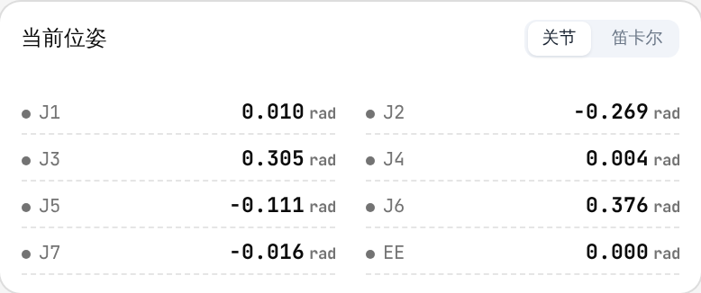

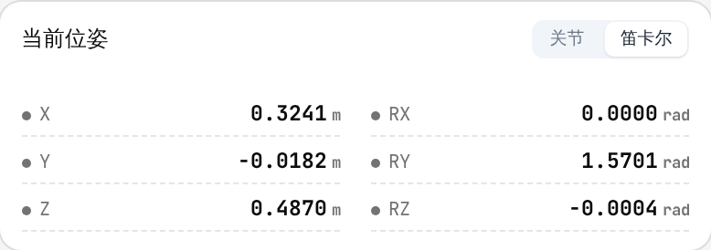

- 关节空间：显示 J1 至 J7 七个轴的实时角度（rad）；
- 笛卡尔空间：显示工具中心点（TCP）相对于基座坐标系的位置（`X, Y, Z`，单位：m）与姿态（`Roll, Pitch, Yaw`，单位：rad）。

### 3.3 实时遥测曲线

提供实时运行波形图，动态监控各关节物理指标：

- 监测指标：
  - 温度（°C）：各轴驱动器温度；
  - 速度（rad/s）：各关节当前旋转角速度；
  - 力矩（Nm）：各关节输出力矩；
  - 跟踪误差（rad）：目标角度与实际反馈角度之间的偏差；
- 通道控制：可单独勾选 J1–J7 曲线，支持「全选」、「清空」与波形「暂停/继续」。

---

### 3.4 控制栏与运行模式

汇集机械臂的全局控制与模式切换功能：

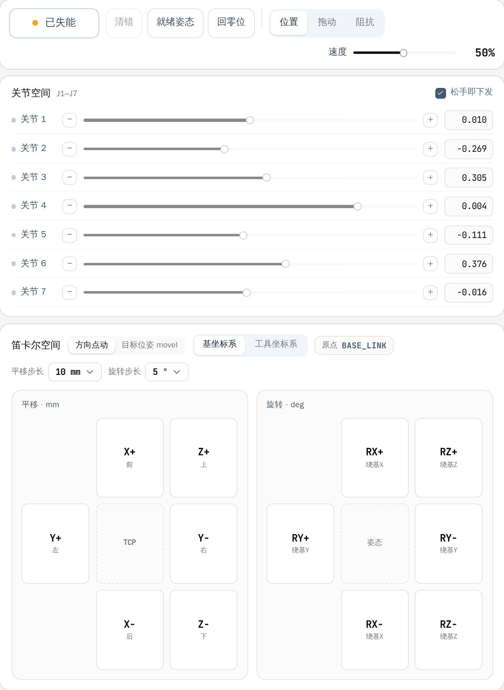

#### 核心控制按钮

- 使能 / 失能：控制机械臂电机的通电与锁止。
  - 点击使能：电机通电并锁住当前姿态，进入可操作状态；
  - 点击失能：弹出确认提示。注意：失能后电机将切断力矩输出，机械臂会在自重下下坠，失能前请务必用手扶稳机械臂或将其放置在安全支撑面上；
- 清错：一键清除电机驱动器的过流、过温等报警。当各关节恢复正常后，系统自动恢复至就绪状态；
- 就绪姿态：控制机械臂平稳移动至预设的标准作业姿态，作为各项任务的起始基准位；
- 回零位：控制机械臂平稳回到各关节均为 0 度的直立零点，常用于初始校准或异常越界时的脱困复位；
- STOP 急停：立即中止当前所有运动并原地锁止机械臂。若遇人员涉险或设备碰撞等紧急危险情况，请直接切断机械臂动力电源。

#### 控制模式切换

- 位置模式：标准伺服控制模式，控制器以高刚度闭环持位，精确执行关节微调或笛卡尔规划指令；
- 拖动模式：启用动态重力补偿与零力示教算法，电机按实时动力学模型提供重力抵消力矩，操作人员可轻便手动拖动机械臂示教动作；
- 阻抗模式：柔顺关节阻抗控制模式，具备可配置的刚度与阻尼，当机械臂受到外部阻碍或碰撞时产生柔顺缓冲，提高人机协作安全性；
- 全局速度调节：通过滑条调节 1%–100% 全局运行速度倍率，限制所有动作指令的速度上限（映射至底层驱动与规划器的速度标量）。

---

### 3.5 关节空间控制

- J1–J7 独立滑条：对应各关节安全极限角度，显示实时百分比与弧度值；
- 单步微调按钮：点击 `◀` / `▶` 对单一关节进行小步长增减；
- 松手即下发：
  - 勾选（默认）：拖动滑条松开鼠标瞬间，机械臂平滑移动至目标角度；
  - 取消勾选：暂存模式，调整多个滑条后点击「发送」一次性复合下发。

---

### 3.6 笛卡尔空间控制

支持以末端工具为基准进行空间位姿调整：

#### 方向点动模式

- 参考坐标系：
  - 基坐标系：以机械臂底座为基准；
  - 工具坐标系：以末端工具 TCP 朝向为基准；
- 平移方向盘：长按 `前 / 后 / 左 / 右 / 上 / 下` 按钮持续沿轴向直线进给，松手即停；可选步长 1 / 5 / 10 / 25 / 50 mm；
- 旋转方向盘：长按旋转按钮（绕 X / Y / Z 轴）以末端 TCP 为中心旋转姿态，松手即停；可选步长 1 / 5 / 10 / 15 / 30°。

#### 目标位姿直线运动

- 位姿输入：输入目标空间坐标 `X, Y, Z`（m）与欧拉角 `Roll, Pitch, Yaw`（rad）；
- ⇠ 同步当前位姿：将机械臂当前实时 TCP 位姿填入输入框，便于微调；
- 直线运动到目标位姿：规划直线插补轨迹平滑运动至目标位姿。

---

### 3.7 轨迹示教录制与回放

通过手动拖动完成动作示教与复现：

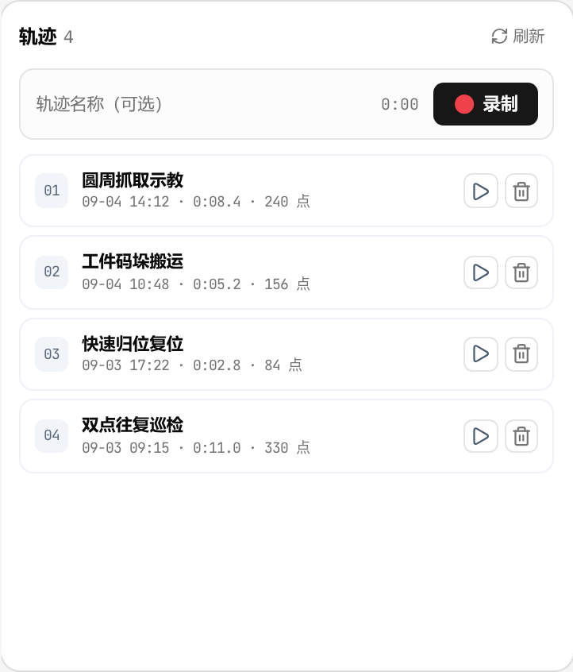

#### 轨迹录制流程

1. 输入轨迹名称（如 `pick_and_place_01`）；
2. 点击「开始录制」，机械臂自动切换至零重力拖动模式，记录实时姿态；
3. 手动拖动机械臂完成作业动作；
4. 点击「停止并保存」，轨迹文件自动保存至后端主机。

#### 轨迹回放操作

- 选择轨迹：展开轨迹卡片，查看持续时间与采样点数；
- 回放倍速：支持 0.25×、0.5×、1.0×、2.0× 倍速（实际速度 = 全局速度 × 倍速）；
- 循环回放：开启后，轨迹执行完毕将自动循环重复；
- 开始 / 停止：点击「开始回放」执行动作，执行期间关节滑条与点动操作自动锁定；
- 中止接管：回放过程中点击「中止接管」或 STOP，立即停止回放并恢复手动控制；
- 删除轨迹：点击垃圾桶图标确认后删除。

---

### 3.8 末端执行器（夹爪与灵巧手）

系统原生支持电动平行夹爪与多自由度仿生灵巧手等多种末端执行器，设备挂载或连接后自动识别并展开专用控制面板：

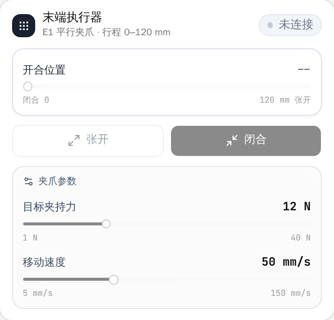

- 电动平行夹爪控制：
  - 行程与开度调节：支持在全行程范围内通过滑条连续设定目标开度，松手即平滑到达指定开度；
  - 快捷操作：提供「张开」与「闭合」快捷按钮，一键全行程开合；
  - 夹持力设定：可设定夹紧力上限（1–40 N），防止夹损易碎工件；
  - 移动速度：可配置开合运动速度上限（5–150 mm/s）；
  - 清除故障：夹爪遇阻或驱动过载报警时，一键清除故障恢复就绪。
- 多自由度仿生灵巧手控制：
  - 支持各手指关节独立角度与弯曲度设定；
  - 提供典型抓取手势（握拳、张开、捏取等）快速调用与微调；
  - 实时监控灵巧手各指驱温度与受力反馈。

## 4. 遥测与系统日志

「日志」页面用于管理机械臂运行期间的遥测采样数据与系统诊断日志。

### 4.1 遥测采样与会话管理

上位机连接后，系统以约 10 Hz 频率在本地连续记录关节角度、角速度、力矩、驱动器温度与故障状态。

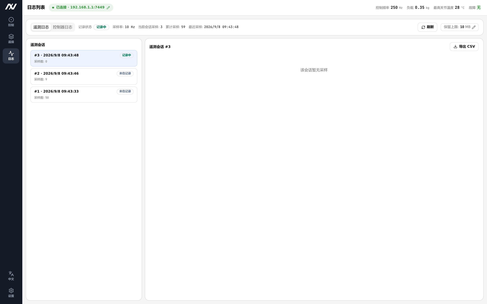

- 会话列表：展示历史连接会话记录，清晰呈现开始时间、记录时长、采样点数及存储体积；
- 数据明细：展开会话可逐行查看时间戳、七轴角度、角速度、力矩、驱动器与电机温度样本；
- 存储配额设置：
  - 点击顶部的「保留上限: N MB」编辑按钮；
  - 支持在 10 MB 至 500 MB 范围内配置本地存储配额；
  - 超出上限时自动淘汰最旧的历史会话，防止占用过多本地存储空间。

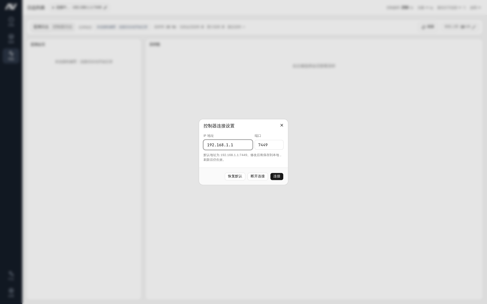

### 4.2 采样数据导出（CSV）

点击「导出 CSV」按钮，将当前会话的时间序列数据导出为 `.csv` 文件，便于使用 Python、MATLAB 或 Excel 进行离线分析。

### 4.3 后端运行日志

切换至「控制器日志」标签页，实时查看 `litearm-server` 后台进程的运行与诊断日志：

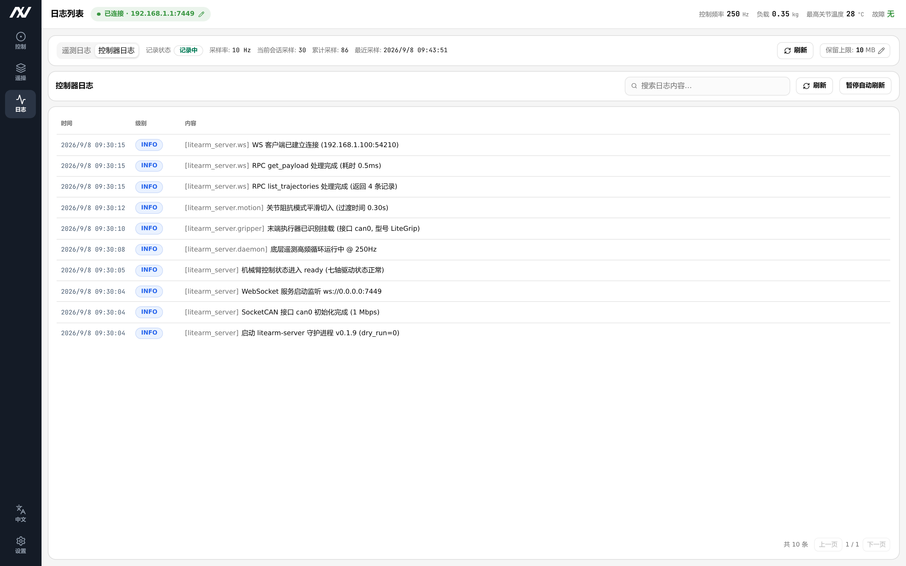

- 日志级别：直观标记 DEBUG、INFO、WARNING、ERROR、CRITICAL 各级别输出；
- 关键词检索：在搜索框输入关键词（如 `gripper`、`motion`、`fault`）即时过滤日志；
- 自动刷新：页面每 5 秒自动拉取最新日志，可手动点击「刷新」或「暂停」。

---

## 5. 系统与算法设置

「系统设置」页面提供机械臂动力学校准、安全限幅、控制算法调参及系统运维工具。

### 5.1 负载与安装姿态校准

准确配置负载与安装姿态是实现重力补偿与拖动示教的前提。

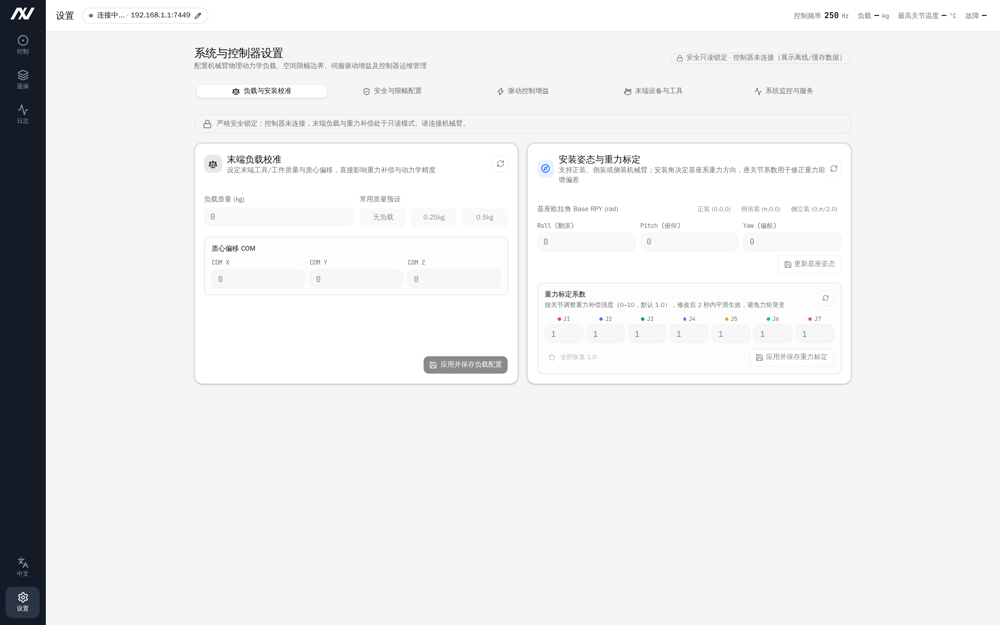

- 末端负载校准：
  - 输入末端夹具与工件的总质量（kg）；
  - 输入相对于末端法兰的质心偏置 (X, Y, Z)（单位：m）；
  - 提供 `无负载`、`0.25 kg`、`0.5 kg` 快速预设；点击「应用并保存负载配置」生效。
- 安装姿态与重力标定：
  - 基座安装位姿：提供 `正装 (0,0,0)`、`倒吊装 (π,0,0)`、`侧立装 (0,π/2,0)` 预设，并可微调 Roll、Pitch、Yaw 欧拉角（rad）；点击「更新基座姿态」生效；
  - 重力标定系数：独立调节 J1–J7 各关节的重力补偿强度（0–10，默认 1.0），下发时平滑渐变生效避免力矩突变，支持一键「全部恢复 1.0」。

---

### 5.2 安全与限幅配置

查看与配置机械臂的物理与空间安全边界。

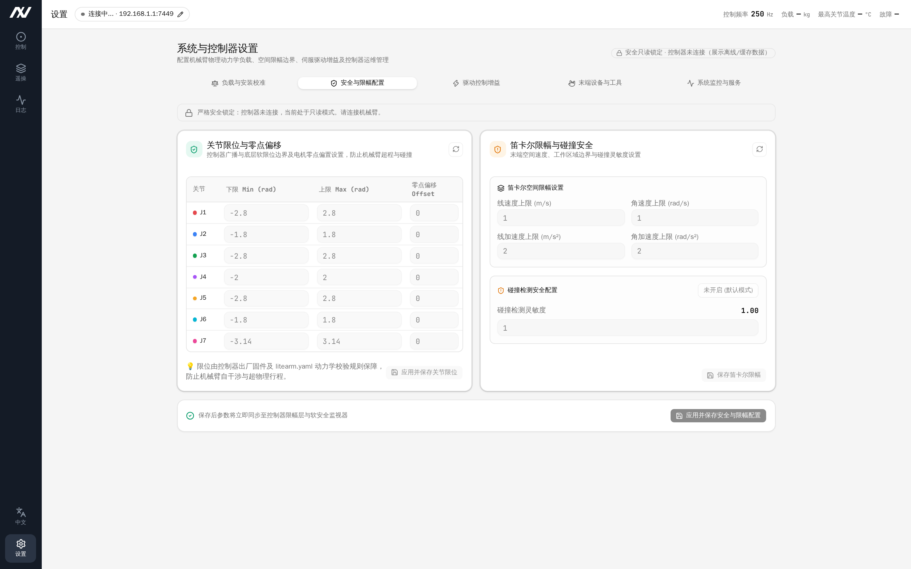

- 关节限位与零点偏移：展示与配置 J1–J7 各关节软限位下限、上限（rad）及电机零点偏置；
- 笛卡尔限幅与碰撞安全：配置末端最大线速度、角速度、线加速度、角加速度上限，以及碰撞检测开关与灵敏度；
- 限位由底层固件与动力学配置共同约束，防止超行程与碰撞。

---

### 5.3 驱动控制增益与驱动器管理

针对七个关节伺服驱动器的控制参数管理：

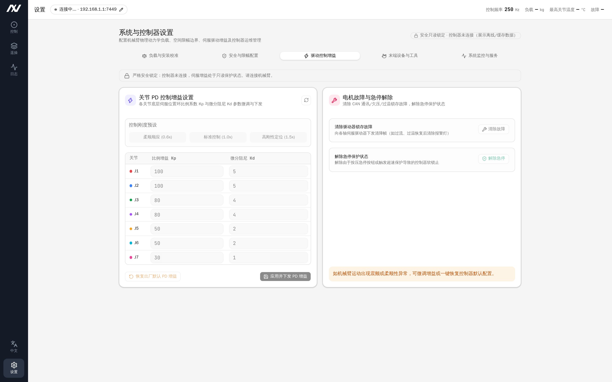

- PD 控制增益：展示各轴位置比例增益 Kp 与微分阻尼增益 Kd，提供「柔顺顺应 (0.6x)」、「标准控制 (1.0x)」、「高刚性定位 (1.5x)」刚度预设；
- 恢复出厂默认 PD 增益：出现异常震颤或刚度不足时，可一键恢复出厂标称增益；
- 电机故障与急停解除：向驱动器下发清错指令，或解除由于外部触发产生的软锁止状态。

---

### 5.4 末端设备与工具管理

管理机械臂末端挂载的执行器设备与通信绑定：

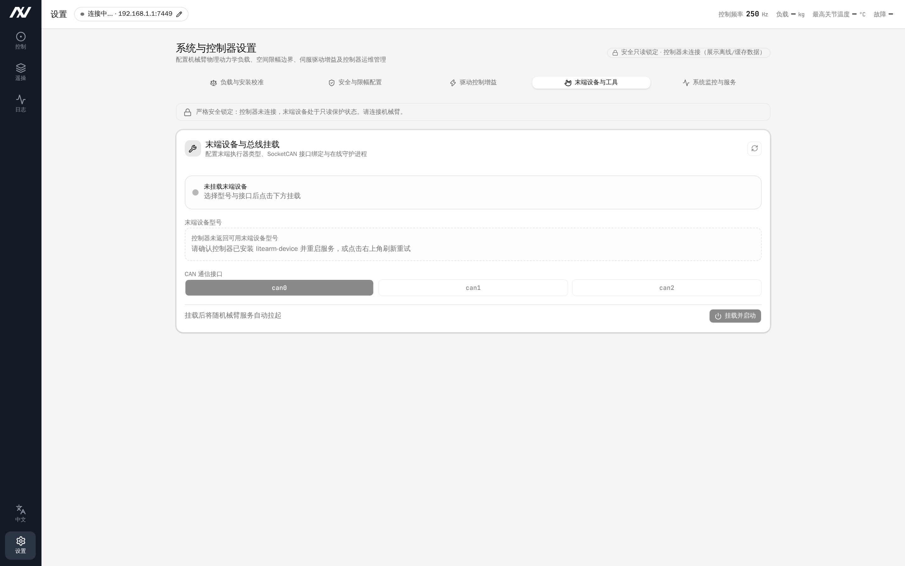

- 设备类型选择：支持夹爪（Gripper）与多自由度灵巧手（Hand）等设备型号；
- 通信接口绑定：选择绑定的 SocketCAN 接口（如 `can0`）；
- 挂载与守护：点击「挂载并启动」拉起末端设备守护进程，或在更换末端工具时点击「卸载设备」。

---

### 5.5 系统监控与服务运维

监控主机底层硬件资源，并提供后台服务运维工具：

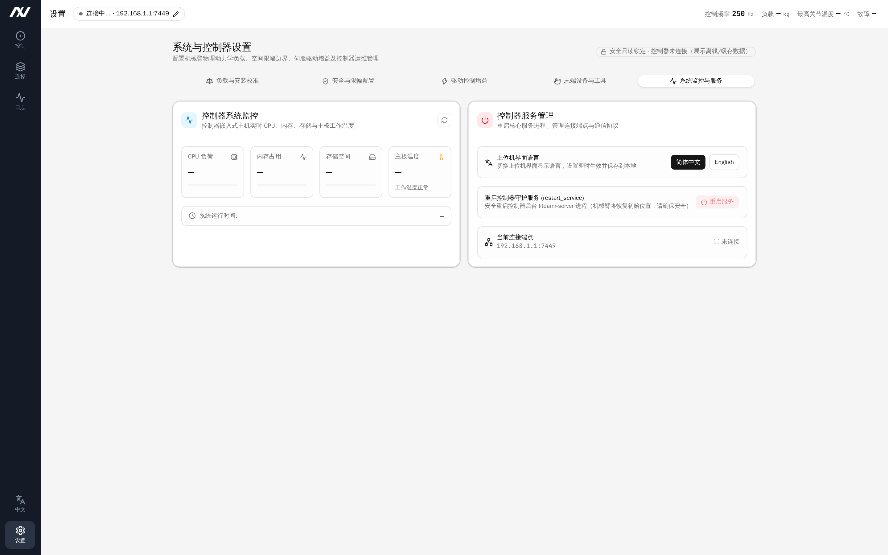

- 硬件资源监控：
  - 主机 CPU 占用率；
  - 内存使用率；
  - 磁盘剩余空间；
  - 主板核心温度（超过 70°C 时预警）；
  - 连续运行时间；
- 重启后端服务：
  - 重启主机上的 `litearm-server` 后台进程；
  - 重启期间连接会短暂断开并在数秒后自动重连；
  - 注意：服务重启时机械臂将重新初始化并回到安全持位状态，务必在机械臂处于静止安全状态时执行。

---

## 6. 安全操作规程与常见故障排查

### 6.1 现场安全操作规程

1. 上电与连接确认：上电后，先通过上位机确认后端服务连接正常、无报警，再执行使能；
2. 使能与失能防护：
   - 机械臂使能时会通电锁位，确保周边无卡阻；
   - 失能前必须扶稳机械臂，防止因失电重力自坠造成损坏；
3. 零重力拖动示教：进入拖动模式后，平稳引导机械臂运动，避免急速甩动，注意防止关节缝隙夹手；
4. 急停与紧急处置：
   - 上位机界面的红色 STOP 按钮用于打断在途运动并就地高刚度锁止；
   - 遭遇人员涉险或设备碰撞等紧急险情时，应立即切断机械臂动力供电电源；
5. 规范维护：严禁擅自修改底层配置文件或固件。

---

### 6.2 常见故障与处理速查表

| 故障现象 | 潜在原因 | 排查与解决方法 |
| :--- | :--- | :--- |
| 顶栏显示「连接失败」 | 1. 本地 `litearm-server` 服务未运行或启动失败 2. USB-CAN 适配器未连接或 `can0` 接口异常 3. 连接 IP/端口配置错误（直连默认 `127.0.0.1:7449`） | 1. 执行 `sudo systemctl status litearm-server-bin` 检查服务状态 2. 检查 USB-CAN 适配器与供电线缆连接 3. 点击连接徽标，核对 IP 地址与端口 `7449` 4. （跨机连接时）检查两台设备网络连通与防火墙放行 |
| 点击运动提示「机械臂正在运动，请等待」 | 上一条运动指令尚未执行到位，运动互斥生效 | 属于正常安全互斥机制，等待运动到位或点击 STOP 急停释放控制权 |
| 顶栏亮红灯，提示「关节 N 驱动故障」 | 机械臂发生碰撞受阻、关节过流或驱动温度过高（>80°C） | 1. 检查机械臂是否受外力阻挡或负载过重 2. 排除阻碍并待温度冷却后，点击控制栏「清错」按钮 3. 若故障仍未清除，扶稳机械臂后点击「失能」再重新「使能」 |
| 提示「控制器处于 fault 状态」 | 触发了安全超速、位姿越界或通信超时等系统级安全保护 | 驱动清错无法解除系统级安全保护。需在扶稳机械臂下点击「失能」再重新「使能」，或在设置页重启后端服务 |
| 夹爪提示「未连接」或无法动作 | 夹爪线缆松脱、设备离线或供电异常 | 1. 检查末端航空插头连接是否紧固 2. 重新连接上位机，系统将自动重连夹爪 3. 在夹爪控制面板点击「清除故障」 |
| 轨迹列表为空 | 1. 当前处于「仿真模式」 2. 后端尚未录制或保存任何轨迹文件 | 1. 确保在 3D 视口右上角切换为「实机模式」并连接后端 2. 参照第 3.7 节录制新轨迹 |
| 遥测日志未产生数据 | 上位机未处于「已连接」状态 | 建立连接后数据将自动开始采样记录 |
