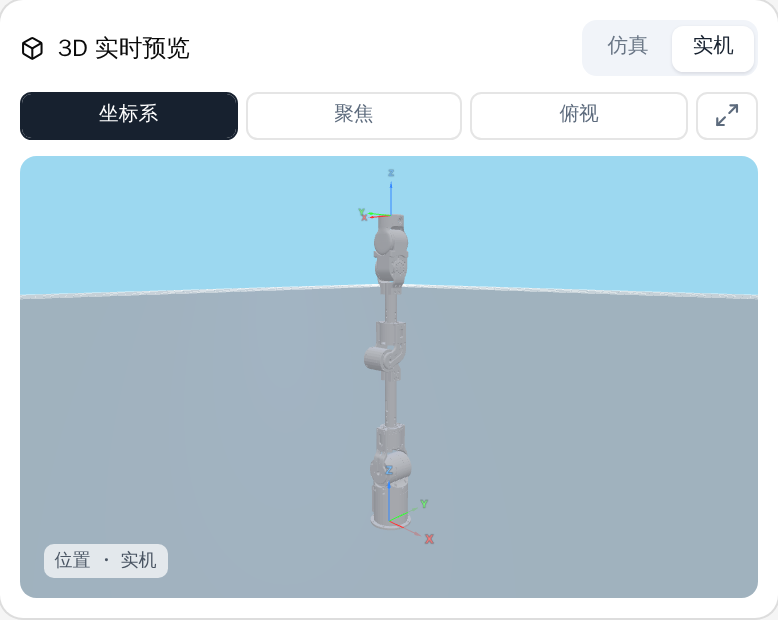
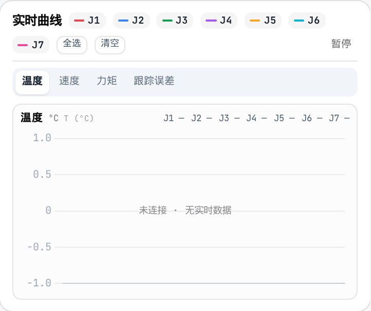
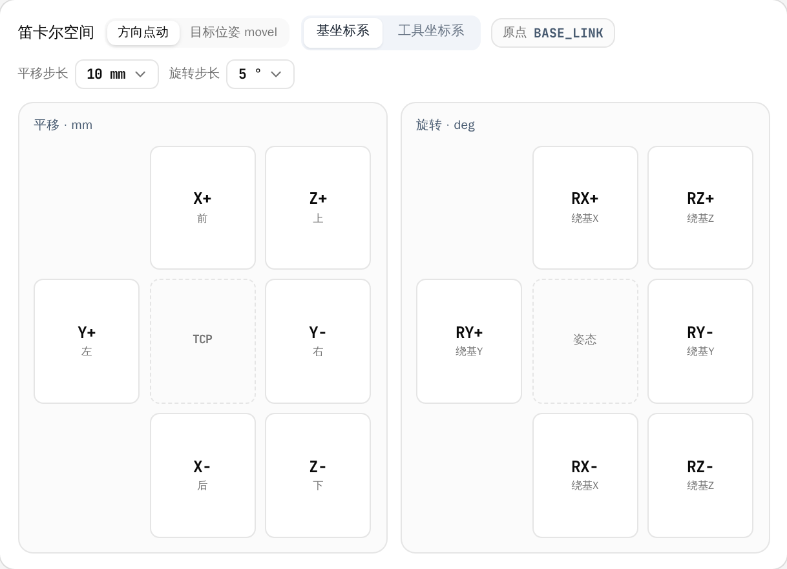
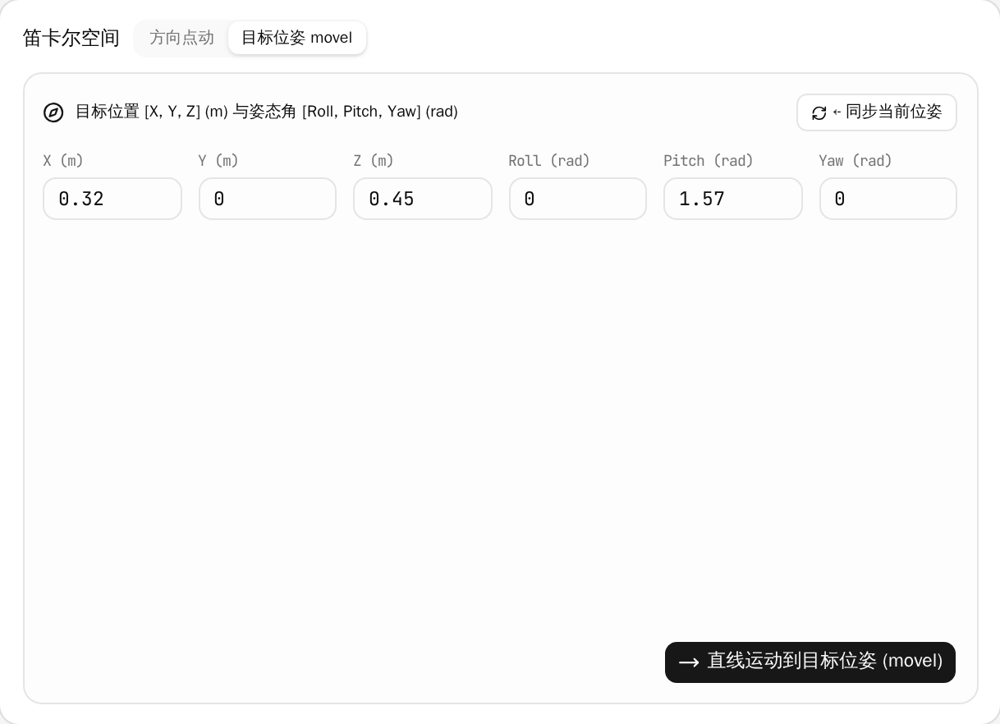

# LiteArm Studio 操作手册

## 1. 软件简介与连接

> [!IMPORTANT]
> 机械臂运动具备一定惯性与力量。在使能、控制运动或下发参数前，必须确保机械臂工作范围内无人员驻留、无障碍物干涉。

### 1.1 软件简介

LiteArm Studio 是 LiteArm 七自由度（J1–J7）机械臂的图形化上位机软件，提供实时运动控制、状态监控及系统管理能力。

软件由**一个本地程序**（`litearm-studio-daemon`）和**一个浏览器界面**组成：本地程序独占机械臂的 USB 串口，界面由它托管，两者在本机回环上通信。**没有后端服务器，也不需要填任何 IP。**

```
浏览器窗口（React 界面，由本地程序托管）
   │ HTTP → 静态资源、/api/health
   │ WS   → 状态推送 / 命令
   ▼
litearm-studio-daemon（只监听 127.0.0.1）
   ▼
STM32 固件 ──USB CDC（1d50:606f）──> CAN ──> 电机
```

| 核心模块 | 主要功能 |
| :--- | :--- |
| 单臂控制 | 3D 姿态监控与仿真、关节角度控制、笛卡尔空间点动与直线插补、控制模式切换、一键回零位 |
| 遥测 | 关节遥测数据采样记录、会话明细与 CSV 导出 |
| 系统设置 | 末端负载与安装姿态标定、重力与惯量、增益与限位、诊断、夹爪与总线、授权激活 |
| 授权激活 | 新机器第一次使用前，填一份注册信息完成激活 |

### 1.2 安装与运行

从发布页下载对应平台的可执行文件，并用同目录的 `.sha256` 校验完整性：

| 平台 | 文件 | 运行方式 |
| :--- | :--- | :--- |
| Ubuntu / Debian | `litearm-studio-<版本号>_amd64.deb` | `sudo apt install ./litearm-studio-<版本号>_amd64.deb` |
| Windows | `litearm-studio-<版本号>-windows-amd64.exe` | 双击运行 |
| 其他 Linux | `litearm-studio-<版本号>-linux-amd64` | `chmod +x` 后运行 |

`.deb` 还会装上桌面入口和 udev 规则，装了它就不必把用户加进 `dialout` 组。单文件版下载后没有
执行权限，且需要 glibc 2.35 及以上（Ubuntu 22.04+、Debian 12+）；下载命令、校验方法、串口权限
与首次激活见 [INSTALL_ZH.md](INSTALL_ZH.md)。

程序是**自包含**的：不需要预装 Python，也不需要单独打开浏览器标签页——本地程序会自行开窗（检测到 Chromium 系浏览器时以应用窗口方式打开，否则退回普通标签页）。启动后会打印实际监听的地址，默认 `http://127.0.0.1:8765/`；端口被占用时会自动往后找并打印新端口，**以打印出的地址为准**。

> [!IMPORTANT]
> **Linux 下必须先给当前用户串口权限**（设备节点通常属于 `dialout` 组），否则界面能打开、但连不上机械臂：
> ```bash
> sudo usermod -aG dialout "$USER"   # 重新登录后生效
> ```
> 或者写一条 udev 规则（VID:PID `1d50:606f`，权限 `0666`）。

### 1.3 连接机械臂

本地程序启动后**自动查找**机械臂的 USB CDC 设备（VID:PID `1d50:606f`），找到即建立会话。顶栏左侧的徽标实时反馈状态：

| 徽标状态 | 显示 | 说明 |
| :--- | :--- | :--- |
| 已连接 | 绿色圆点 · `<端口名> · <固件版本>` | 会话已建立，可控制与监控 |
| 连接中 / 重连中 | 灰色 / 闪烁 · `连接中…` | 正在建立会话；链路断开后自动重试 |
| 连接失败 | 红色圆点 · `连接失败` | 没找到设备、固件版本不符，或链路故障 |

顶栏的**连接 / 断开**按钮用于手动建立或结束会话。**没有任何 IP 地址或端口需要填写**；若设备出现在非默认路径，可用 `--port` 指定。

### 1.4 激活机械臂

> [!IMPORTANT]
> 新机械臂首次使用前必须激活，否则「使能」无效。其他功能不受影响。

激活只需操作一次。开始前请确认：

- 电脑已联网；
- 机械臂已通过 USB 连接，顶栏显示「已连接」；
- 机械臂处于安全状态。

**操作步骤：**

1. 进入「设置」页面，点击「授权激活」；
2. 页面显示「已激活」时，无需任何操作；
3. 页面显示「未激活」时，填写表单。姓名、电话、单位、邮箱、所在地区为必填，其余选填；
4. 勾选《激活注册信息同意书》；
5. 机械臂若处于使能状态，先在控制栏点击「失能」，并扶稳机械臂——失能后它会因自重下垂；
6. 点击「提交并激活」，等待几秒钟。

页面显示「已激活」即激活成功，此时可以正常使能。

**遇到问题：**

| 页面提示 | 处理方法 |
| :--- | :--- |
| 没有这台机器的凭据 | 点击「复制」，将机器编号发送给供应商 |
| 请先按「失能」 | 在控制栏点击「失能」后重新提交。失能后机械臂会因自重下垂，请先扶稳 |
| 连不上激活服务 | 检查网络连接后重试 |
| 提交过于频繁 | 等待几分钟后重试 |
| 读不到设备的授权记录 | 检查 USB 连接和机械臂电源，点击「刷新」后重试 |
| 这台固件没有授权功能 | 固件版本过低，请先升级固件（见 §5.7） |
| 其他提示 | 点击「刷新」查看状态；仍未激活请联系供应商 |

**注意：**

- 激活仅对当前机械臂有效，更换机械臂需重新激活；
- 激活后无法在软件中撤销；
- 激活是本软件唯一需要联网的操作，仅提交表单中填写的内容。

#### 顶部实时运行指标

顶栏右侧显示机械臂核心运行指标：

- 控制频率：底层控制循环实时频率（标称约 250 Hz）；
- 负载：当前已生效的末端负载质量（kg）；
- 最高关节温度：各关节驱动器的当前最高温度（°C）；
- 故障状态：运行健康度（绿色「无故障」/ 红色「存在故障」）。

---

## 2. 界面布局总览

LiteArm Studio 包含左侧导航栏、顶部状态栏与中央主工作区，点击左侧导航栏可在各功能模块之间快速切换。

---

## 3. 单臂控制

「单臂控制」页面提供机械臂 3D 姿态监控、实时状态读数、关节与笛卡尔空间运动控制及 LiteGrip 夹爪操作。

### 3.1 3D 机械臂姿态实时视口



- 模式切换：
  - 实机模式：模型同步机械臂实时关节角度；
  - 仿真模式：仅在界面中预览姿态，不下发真机动作；
- 视口交互：鼠标左键按住拖拽旋转视角，滚轮缩放，右键按住拖拽平移视口；
- 快捷工具栏：
  - 坐标系：开启/关闭各关节与基座的坐标轴辅助线；
  - 聚焦：重置视口中心至机械臂主体；
  - 俯视：切换至正上方俯视视角；
  - 全屏放大：展开全屏视口对话框。

### 3.2 当前位姿监控

关节与笛卡尔读数合并在同一张「当前位姿」卡片里，左右两栏同时可见：

- 左栏关节空间：显示 J1 至 J7 七个轴的实时角度（rad）；
- 右栏笛卡尔空间：显示工具中心点（TCP）相对于基座坐标系的位置（`X, Y, Z`，单位：m）与姿态（`Roll, Pitch, Yaw`，单位：rad）；
- 固件未编译笛卡尔规划时右栏给出说明，而不是显示一个编出来的位姿。

### 3.3 实时遥测曲线

一次只画一个指标的实时波形，看哪个由你切换：



- 面板位置：在左列「当前位姿」下方，高度压扁成一条，只够把选中的那条指标画清楚；
- 指标切换：在「温度（°C）」「速度（rad/s）」「力矩（Nm）」「跟踪误差（rad）」之间切换。面板只画选中的那一条指标，其余靠标签切换，而不是把四张图挤在一起。
- 记忆选择：选中的指标下次打开控制页时保持，默认是温度。
- 通道控制：可单独勾选 J1–J7 曲线，支持「全选」、「清空」与波形「暂停/继续」。
- 当前读数：指标名右侧的 J1–J7 数值是该指标最新一帧的读数；跟踪误差在实机广播中不存在，会显示「暂无实时数据」。

---

### 3.4 控制栏与运行模式

汇集机械臂的全局控制与模式切换功能：

#### 核心控制按钮

- 使能 / 失能：控制机械臂电机的通电与锁止。
  - 点击使能：电机通电并锁住当前姿态，进入可操作状态；
  - 点击失能：弹出确认提示。注意：失能后电机将切断力矩输出，机械臂会在自重下下坠，失能前请务必用手扶稳机械臂或将其放置在安全支撑面上；
- 清错：一键清除电机驱动器的过流、过温等报警。当各关节恢复正常后，系统自动恢复至就绪状态；
- 就绪姿态：控制机械臂平稳移动至预设的标准作业姿态，作为各项任务的起始基准位；
- 回零位：控制机械臂平稳回到各关节均为 0 度的直立零点，常用于初始校准或异常越界时的脱困复位；
- STOP 急停：立即中止当前所有运动并原地锁止机械臂。若遇人员涉险或设备碰撞等紧急危险情况，请直接切断机械臂动力电源。

#### 控制模式切换

- 位置模式：标准伺服控制模式，控制器以高刚度闭环持位，精确执行关节微调或笛卡尔规划指令；
- 拖动模式：启用动态重力补偿与零力示教算法，电机按实时动力学模型提供重力抵消力矩，操作人员可轻便手动拖动机械臂示教动作；
- 全局速度调节：通过滑条调节 1%–100% 全局运行速度倍率，限制所有动作指令的速度上限（映射至底层驱动与规划器的速度标量）。

---

### 3.5 关节空间控制

- J1–J7 独立滑条：对应各关节安全极限角度，显示实时百分比与弧度值；
- 单步微调按钮：点击 `◀` / `▶` 对单一关节进行小步长增减；
- 松手即下发：
  - 勾选（默认）：拖动滑条松开鼠标瞬间，机械臂平滑移动至目标角度；
  - 取消勾选：暂存模式，调整多个滑条后点击「发送」一次性复合下发。

---

### 3.6 笛卡尔空间控制

支持以末端工具为基准进行空间位姿调整：

#### 方向点动模式



- 参考坐标系：
  - 基坐标系：以机械臂底座为基准；
  - 工具坐标系：以末端工具 TCP 朝向为基准；
- 平移方向盘：长按 `前 / 后 / 左 / 右 / 上 / 下` 按钮持续沿轴向直线进给，松手即停；可选步长 1 / 5 / 10 / 25 / 50 mm；
- 旋转方向盘：长按旋转按钮（绕 X / Y / Z 轴）以末端 TCP 为中心旋转姿态，松手即停；可选步长 1 / 5 / 10 / 15 / 30°。

#### 目标位姿直线运动



- 位姿输入：输入目标空间坐标 `X, Y, Z`（m）与欧拉角 `Roll, Pitch, Yaw`（rad）；
- ⇠ 同步当前位姿：将机械臂当前实时 TCP 位姿填入输入框，便于微调；
- 直线运动到目标位姿：规划直线插补轨迹平滑运动至目标位姿。

---

### 3.7 LiteGrip 夹爪

LiteGrip 两指平行夹爪与机械臂共用一条 CAN 总线，占满控制页右列急停下方的剩余高度。它有独立的连接、使能与急停控制；CAN 通道、装配方向、标定与行程在**设置 → 夹爪与总线**（§5.4）中配置，面板底部的标定折叠区里也重复一行等宽的通道与 CAN ID。

- 连接 / 断开：建立或结束夹爪会话。只有程序报告了夹爪会话时「连接」才可用——Linux 版守护进程有，Windows 版没有；
- 使能 / 失能：给夹爪驱动器上电或释放。开合与标定都需要驱动器处于使能状态；
- 开度：滑条以毫米设定目标开度，松手即下发；实时读数显示在面板标题旁；
- 张开 / 闭合：驱动到张开或闭合的机械限位；
- 夹取：按**目标夹持力**上限闭合，避免夹损易碎工件；
- 零重力：释放驱动器，可用手扳动夹爪；
- 急停 / 解除急停 / 清除故障：立即停止、解除已锁存的急停、清除驱动器故障；
- 夹爪参数（默认收起）：**目标夹持力**（0–40 N）与**移动速度**（5–150 mm/s）；
- 标定：面板显示当前生效的标定来源（实测、标称模板或出厂回退）。使用标称模板时会拒绝毫米目标，需先跑一次零位标定。

## 4. 遥测

「遥测」页面用于管理机械臂运行期间的遥测采样数据。

### 4.1 遥测采样与会话管理

上位机连接后，系统以约 10 Hz 频率在本地连续记录关节角度、角速度、力矩、驱动器温度与故障状态。

- 会话列表：展示历史连接会话记录，清晰呈现开始时间、记录时长、采样点数及存储体积；
- 数据明细：展开会话可逐行查看时间戳、七轴角度、角速度、力矩、驱动器与电机温度样本；
- 存储配额设置：
  - 点击顶部的「保留上限: N MB」编辑按钮；
  - 支持在 10 MB 至 500 MB 范围内配置本地存储配额；
  - 超出上限时自动淘汰最旧的历史会话，防止占用过多本地存储空间。

### 4.2 采样数据导出（CSV）

点击「导出 CSV」按钮，将当前会话的时间序列数据导出为 `.csv` 文件，便于使用 Python、MATLAB 或 Excel 进行离线分析。

### 4.3 链路诊断

当前版本没有独立的「控制器日志」页面。链路健康度看**设置 → 诊断**里的**固件自检**：它跑一遍运动学自检，并给出链路诊断计数（CRC 错误、FIFO 丢帧）——USB 链路出问题时，这些数字最先动。整体运行指标见顶栏（控制频率、最高关节温度、故障状态）。

---

## 5. 系统与算法设置

「设置」页面按**页签**组织，共七项：**末端负载 / 重力与惯量 / 增益与限位 / 诊断 / 夹爪与总线 / 授权激活 / 固件升级**（授权激活见 §1.4，固件升级见 §5.7）。

### 5.1 末端负载

配置工具/工件的质量与质心，供固件的重力前馈使用。

- **质量**（kg）与**质心 X / Y / Z**（相对末端法兰，单位 m），对应固件前馈 item 4 与 5；
- ⚠ 固件对这些值是**静默钳幅**（质量夹到 ≥ 0，质心夹到 ±1 m）而不是拒绝，所以面板上「生效值」那一行才是真值——它是写进去之后读回来的。

---

### 5.2 重力与惯量

- **逐轴重力系数**：每个关节的前馈增益，`1.0` 是固件默认值；
- **逐轴惯量系数**：前馈惯量项；
- **重力方向**：基座坐标系下的重力单位向量（前馈标量 item 6）；
- ⚠ 固件的前馈向量固定为 **7 通道**。这台臂上报的轴数更少时，界面只画存在的通道，但**保存仍会写入完整的 7 个值**。

---

### 5.3 增益与限位

- **逐轴增益与软限位**：各关节的 MIT 刚度 / 阻尼 / 力矩钳幅，以及控制页滑条量程所依据的软限位 `q_min` / `q_max`（rad）；
- **持久化到 flash**：固件要求**失能态**才允许擦写，使能状态下会被拒绝；
- **恢复出厂**：把所有参数恢复为出厂默认，此操作不可撤销。

---

### 5.4 夹爪与总线

配置这一路 CAN 上的 LiteGrip 夹爪：**通道、CAN ID、装配方向、标定文件与实测行程**。

- 标定来源分两种：**标称模板**（SDK 自带，只声明装配方向与标称几何，从未在本机实测——所以毫米目标会被拒绝，跑一次零位标定后恢复）与**实测标定**；
- 装配方向必须与实际接线一致：记录声明与实际不一致时界面会明确指出；
- 每通道的**行程记录**是界面上每一个毫米读数的依据，必须跨重启保留；
- 导入实测标定可以直接输入路径，也可以按「浏览…」打开**控制机**（运行本地程序那台机器，不是你面前这台）的文件系统选择器。它从所输路径的所在目录开始，可用「上一级 / 家目录」导航，每个 `*.json` 行上直接显示校验结果，选中即把路径填回输入框。浏览无需连接，导入仍需连接。

---

### 5.5 诊断

- **固件自检**：跑一遍运动学自检，并给出**链路诊断计数**（CRC 错误、FIFO 丢帧）——USB 链路出问题时，这两个数字最先动；
- 运行时的整体指标在**顶栏**：控制频率、最高关节温度与故障状态。

---

### 5.6 授权激活

激活步骤见 §1.4。

---

### 5.7 固件升级

> [!IMPORTANT]
> 升级期间机械臂会失能，急停也无法使用。开始前请确认机械臂已放稳或有支撑，且周围无人。

升级前请先向供应商获取固件文件（`.hex` 或 `.bin`），并确认：

- 电脑已通过 USB 连接机械臂，顶栏显示「已连接」；
- 页面顶部的状态标记显示「就绪」；
- 升级过程中不要断开 USB 或断电。

**操作步骤：**

1. 进入「设置」页面，点击「固件升级」；
2. 点击「选择固件文件」，选择供应商提供的文件；
3. 核对「镜像摘要」中的版本号；
4. 阅读「开始之前必须确认」中的内容，勾选「我确定机械臂在安全状态下」；
5. 点击「开始升级」，等待进度条走完。

页面显示「升级完成」，并给出设备当前的版本号，即升级成功。

升级开始后，在写入固件之前可以点击「取消升级」；开始写入后无法取消。

**遇到问题：**

| 页面提示 | 处理方法 |
| :--- | :--- |
| 未连接控制器 | 先连接机械臂，再升级 |
| 烧录引擎不可用 | 本机没有可用的 USB 烧录引擎。需要 pyusb 与 libusb；Windows 上还要装 ST 的 WinUSB 驱动。都装好仍报此提示，请联系供应商 |
| 这份固件镜像不能用 | 固件文件不正确，请向供应商重新获取 |
| 机械臂没有失能，已中止 | 在控制栏点击「失能」后重试。失能后机械臂会因自重下垂，请先扶稳 |
| 没有找到 DFU 设备 | 检查 USB 线后重试；Windows 还需要安装 ST 的 WinUSB 驱动 |
| 打不开 DFU 设备（权限不足） | 仅 Linux 出现。新增 udev 规则 `SUBSYSTEM=="usb", ATTR{idVendor}=="0483", ATTR{idProduct}=="df11", MODE="0666"`，重新插拔 USB 后重试 |
| 烧录失败 | 直接重试；多次失败请联系供应商 |
| 固件已经写入，但没能重新连上控制器 | 重新插拔 USB 线，在顶栏点击「连接」 |

**注意：**

- 升级不会改动激活信息和出厂标定数据；
- 请只使用供应商提供的固件文件。

---

## 6. 安全操作规程与常见故障排查

### 6.1 现场安全操作规程

1. 上电与连接确认：上电后，先确认上位机已连接机械臂（顶栏显示**端口名 · 固件版本**）、**已完成激活**（见 §1.4）、无报警，再执行使能；
2. 使能与失能防护：
   - 机械臂使能时会通电锁位，确保周边无卡阻；
   - 失能前必须扶稳机械臂，防止因失电重力自坠造成损坏；
3. 零重力拖动示教：进入拖动模式后，平稳引导机械臂运动，避免急速甩动，注意防止关节缝隙夹手；
4. 急停与紧急处置：
   - 上位机界面的红色 STOP 按钮用于打断在途运动并就地高刚度锁止；
   - 遭遇人员涉险或设备碰撞等紧急险情时，应立即切断机械臂动力供电电源；
5. 规范维护：严禁擅自修改底层配置文件或固件。

---

### 6.2 常见故障与处理速查表

| 故障现象 | 潜在原因 | 排查与解决方法 |
| :--- | :--- | :--- |
| 顶栏显示「连接失败」 | 1. 机械臂未上电或 USB 线缆松脱<br>2. 设备没有以 `1d50:606f` 枚举<br>3. Linux 下当前用户没有串口权限<br>4. 串口被别的进程占用 | 1. 检查 USB 线缆与控制器供电<br>2. 确认设备已枚举：Linux 用 `lsusb` 应看到 `1d50:606f`，Windows 在设备管理器里应出现 COM 口<br>3. Linux：把当前用户加入 `dialout` 组后重新登录（见 §1.2）<br>4. 关掉占用串口的其它程序，或用 `--port` 显式指定设备路径 |
| **点「使能」没有反应** | 这台机械臂还没有激活 | 按 §1.4 完成激活，其他功能不受影响 |
| 激活时提示出错 | 提示原因和处理办法见 §1.4 的「遇到问题」表格 | 照表格操作；没勾选同意书也会提示，勾上再提交即可 |
| 点击运动提示「机械臂正在运动，请等待」 | 上一条运动指令尚未执行到位，运动互斥生效 | 属于正常安全互斥机制，等待运动到位或点击 STOP 急停释放控制权 |
| 顶栏亮红灯，提示「关节 N 驱动故障」 | 机械臂发生碰撞受阻、关节过流或驱动温度过高（>80°C） | 1. 检查机械臂是否受外力阻挡或负载过重<br>2. 排除阻碍并待温度冷却后，点击控制栏「清错」按钮<br>3. 若故障仍未清除，扶稳机械臂后点击「失能」再重新「使能」 |
| 提示「控制器处于 fault 状态」 | 触发了安全超速、位姿越界或通信超时等系统级安全保护 | 驱动清错无法解除系统级安全保护。需在扶稳机械臂后点击「失能」再重新「使能」；仍不恢复则重启本地程序 |
| 夹爪提示「未连接」或无法动作 | 夹爪线缆松脱、设备离线或供电异常 | 1. 检查末端连接器是否紧固<br>2. 在夹爪控制面板点击「连接」<br>3. 故障原因排除后点击「清除故障」 |
| 遥测日志未产生数据 | 上位机未处于「已连接」状态 | 建立连接后数据将自动开始采样记录 |
